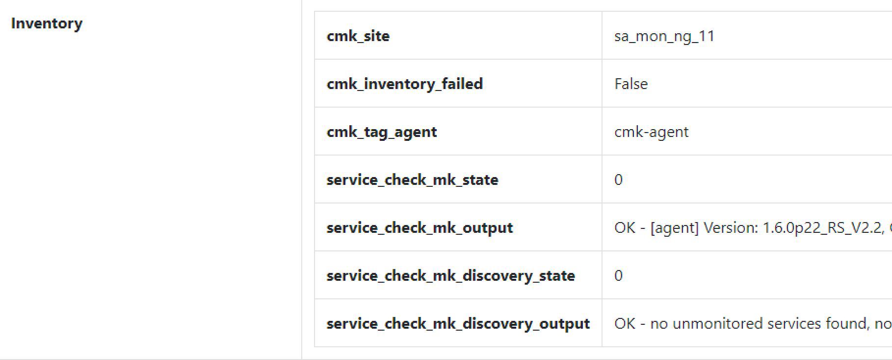
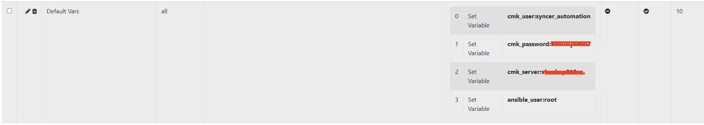
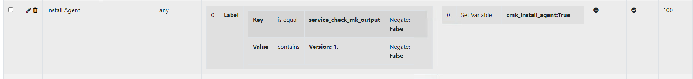
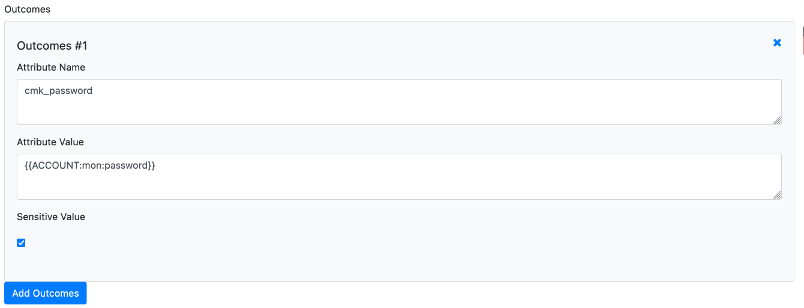
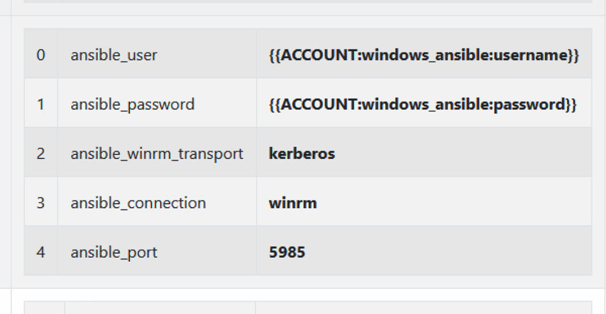

# General
The `cmk_agent_mngmt.yml` Playbook contains everything to manage the Installation and the Bakery and TLS Registrations of your Checkmk Agents. This works for Linux and Windows.

The job of the Syncer is to dynamically provide variables to the Ansible Playbook, so that Ansible always knows what to do with each Host.

Information is inventorized, for example from Checkmk itself, like on which site the host is, or if the Checkmk Agent reports TLS errors. Also, all kinds of known attributes can be used. The Syncer Rules then create all Variables for Ansible dynamically.

## Functions

- Support for Linux and Windows
- Create Host
- Install Checkmk Agents
- Register Checkmk Bakery
- Register TLS for Checkmk
- Discover Host in Checkmk
- Bake and Sign Agents (See Checkmk part)
- Restart Checkmk (See Checkmk part)

## Inventorize Checkmk
To get the current Status Information about the Host — like whether the Agent is in an Error state or whether the Bakery is registered — the inventory function of the Syncer is used. All Information found is added to the Syncer's Database.

The Command is:
`./cmdbsyncer checkmk inventorize_hosts account`.

After the run, you can verify what the Inventory found: open a Host in the Frontend and scroll to inventory:



## Ansible Variables
Next, you need to seed Variables and Conditions. This is necessary for Ansible to know whether an Action is due, or which Credentials to use.

The following Variables exist in the `cmk_host_agent` Ansible Role. You learn below how to set them:

| Variable | Default | Description |
| :--------|:--------|:------------|
| cmk_user | automation | User for Auth in Checkmk and API Operations |
| cmk_secret | — | The Automation Secret for the User |
| cmk_main_server | — | Master site's address (without `https://` or path) |
| cmk_main_site | — | Master site name |
| cmk_server | — | Local, site-specific address for Registrations (Distributed Monitoring) |
| cmk_site | — | Local site name (best rewritten from the inventory: `cmk__label_site` → `cmk_site`) |
| cmk_create_host | False | Create the Host in Checkmk |
| cmk_create_folder | /inbox | Folder for the initial creation of the host by Ansible |
| cmk_install_agent | False | True if the Agent has to be installed |
| cmk_register_tls | False | True if TLS Registration has to be done |
| cmk_register_bakery | False | True if Bakery Registration has to be done |
| cmk_register_central_bakery | False | True for Bakery Registration in a non-distributed Bakery setup |
| cmk_delete_manual_files | False | Set True to delete manually installed Checkmk files on the Server first |
| cmk_discover | False | Trigger a Checkmk Service Discovery on the Host |
| cmk_linux_tmp | /tmp | Temp dir used on Linux |
| cmk_windows_tmp | c:\temp | Temp dir used on Windows |
| cmk_agent_receiver_port | 8000 | Port for Agent TLS Registration |
| cmk_server_port | 443 | Override the default Checkmk 443 port |
| cmk_agent_port | 6556 | Agent port (for the firewall config) |
| cmk_server_ip | False | Use an IP instead of a Hostname when DNS is not available; also needed for the firewall config |
| cmk_main_server_ip | False | Master server IP for DNS-less setups |
| configure_firewall | False | Enable Firewall Configuration for RedHat |
| cmk_agent_configure_firewall_zone | public | Firewall zone to open the agent port in |
| validate_certs | True | Validate Certificates for HTTP Calls |

Some of these are already part of the Inventory after you inventorized Checkmk, others are hardcoded (like Credentials). And finally, there are condition-based ones, like `cmk_register_bakery`, which should only be true if the registration is missing.

### Seed a rule set with one click
To start quickly, open **Rules → Ansible → Rules by Project**, pick (or create) a project, and click **Seed Checkmk Agent variables**. This creates a small, ready-made rule set that already reflects the required logic:

- **Agent Base Config** — matches every host and carries all static variables (credentials, servers, ports, temp dirs). Every action flag defaults to `false` here.
- **Install Agent**, **Register TLS**, **Register Bakery**, **Discover Services** — one conditional rule each. Every rule matches on a Checkmk inventory attribute (e.g. the *Check_MK* service output for a TLS error) and flips a single flag to `true`, overriding the base rule's default for the hosts it matches.

The rules are ordered by their sort field: the base rule (sort 0) supplies the defaults, the action rules (sort 10+) turn things on where their condition matches. All rules are created **disabled** — treat them as a template: adapt the server and credential values, verify the conditions against `./cmdbsyncer ansible debug_host HOST`, then enable them. Re-running the seed only fills in rules that don't exist yet, so your edits are never overwritten.

Alternatively, you can seed a set of default rules from the command line:

`./cmdbsyncer rules import_rules ./example_rules/ansible_cmk_rules.py`


# Syncer Configuration

##  Settings

You can set which Hosts you want to manage via Ansible, or deploy custom Variables to some Hosts with the Ansible Rules. The normal Filter and Rewrite Functions also apply here.

The Conditions are configured in:
**Rules → Ansible → Ansible Attributes** <br>

To set the Credentials Ansible should use to contact Checkmk, see here:


Example of how to Install the Agent when a given Service Output was found:


Likewise, you can configure whether to register to the bakery or the TLS. Filter, for example, for the TLS Error message in the Service Output. Best is to seed defaults as described above, so you have more examples which just need to be adapted a bit.


## Passwords and Account Data as Variables
You don't need to set the Password value directly in the settings, you can also read it from your Accounts. For that, instead of the Password, just Enter the Macro: {{ACCOUNT:NAME:password}}. Account needs to be uppercase, Name is the Account Name, password can also be every other field or custom field in your account Settings.



## RedHat Firewalls
You can configure the Firewall Zones and the Checkmk Server IPs to let the Syncer configure the Firewall for you.

You just need to set `configure_firewall` and also the `cmk_server_ip`


# Run the job

## Debugging
Before you run anything in Ansible, use the debug_host feature to check if the Outcome is what you want:
`./cmdbsyncer ansible debug_host HOSTNAME`
The command will tell you all variable outcomes you will have in Ansible.

## Ansible Command

`ansible-playbook -i inventory cmk_agent_mngmt.yml`

Please just replace the inventory source if needed.


##  Windows Clients and Kerberos
If you have your Linux Server prepared for Kerberos, you can use it with the Syncer to Update/ Install/ Register Windows Agents. This is the Settings you will need for that:




# Known Problems

## Distributed Bakery not supported yet in API
The Checkmk API currently can't reflect a Distributed Setup. Therefore Ansible fails to Download Agents from a remote site.  As Workarround you can set an Apache Reverseproxy Rule, to Forward only the Bakery API Requests to the Main Site.

```
SSLProxyEngine On

SSLProxyCheckPeerCN off

RewriteEngine On

RewriteRule /sitename/check_mk/api/1.0/domain-types/agent/(.*)$ https://mastersite/sitename/check_mk/api/1.0/domain-types/agent/$1 [P]
```


This config must be put into the VirtualHost config for Port 443 on your remote Site.
