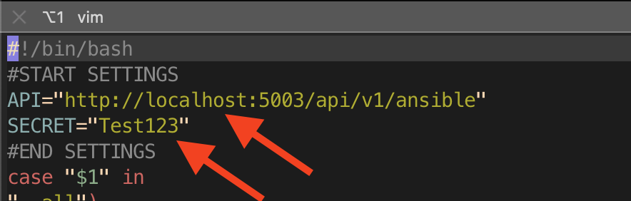
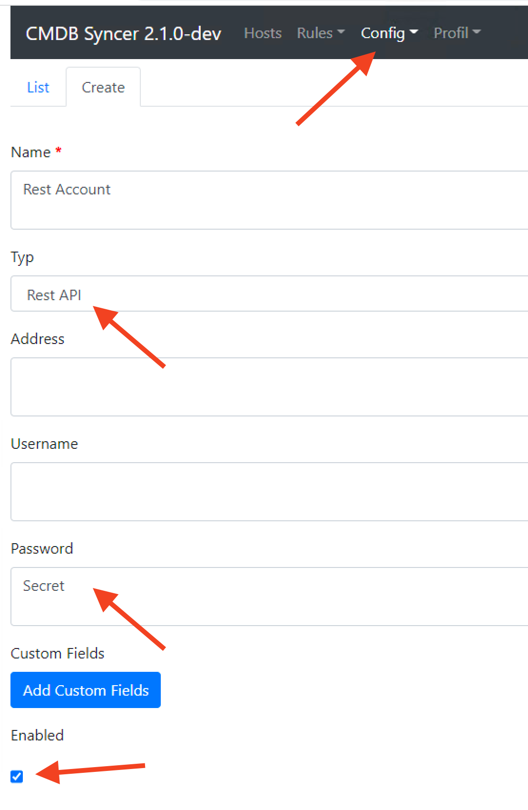

# Ansible Integration
The CMDB Syncer contains Ansible Endpoints and a set of Ansible Playbooks.
As of now, you can basically control all of your own playbooks with rule-based variables from the syncer, or use the provided ones for update and registration of Checkmk Agents (Linux/Windows) or the management and installation of Checkmk Sites on your servers.

## In this section

| Page | Topic |
| :--- | :---- |
| [Run Playbooks from the UI](run_from_ui.md) | Trigger a playbook with one click, dry-run with `--check --diff`, audit every run. |
| [Playbook Manifest](playbook_manifest.md) | How to register your own playbooks (`playbooks.yml` + `.local`) so they appear in the UI. |
| [Inventory Providers](inventory_providers.md) | Cross-module registry that backs both the local CLI inventory and the REST endpoint. |
| [Projects](projects.md) | Group rules into isolated sources; each project becomes its own provider. |
| [Playbook Fire Rules](fire_rules.md) | Rule-driven onboarding — match a host, fire a playbook, dedup automatically. |
| [Example Gallery](example_gallery.md) | Copy-paste-ready playbooks for Windows patching, cron deployment, password rotation, Fileadmin sync. |
| [AWX / Semaphore / AAP](awx_integration.md) | Use the Syncer as a dynamic inventory source from external Ansible orchestrators. |
| [cmdbsyncer-inventory Plugin](cmdbsyncer_inventory.md) | PyPI-installable inventory plugin for remote control nodes. |
| [Playbooks via PyPI Install](playbooks_pypi.md) | Pull the bundled playbook set onto a pip-installed Syncer. |
| [Manage Checkmk Agents](cmk_agents.md) | Reference for the bundled `cmk_agent_mngmt.yml` playbook. |
| [Manage Checkmk Sites](cmk_sites.md) | Reference for the bundled `cmk_server_mngmt.yml` playbook. |

## Config Tricks
If you want to refer to passwords in your Syncer configuration, you can use an integrated macro called ACCOUNT which connects to every field you can set in the account config. The syntax is `MACRONAME:ACCOUNTNAME:FIELDNAME`.

Therefore , to get the Password of account cmk, it would look like:
```
{{ACCOUNT:cmk:password}}
```


## General

Inside the Ansible subfolder you will find inventory entry-points for `ansible-playbook -i …`.

The **recommended** entry-point is the YAML plugin spec, which routes through the [`cmdbsyncer-inventory`](cmdbsyncer_inventory.md) plugin (mode `local` shells the CLI, mode `http` hits the REST API):

| File | Description |
|:----|:-----------|
| `syncer.inventory.yml` | Single plugin spec used for every dispatched playbook. Provider is selected at run time via `CMDBSYNCER_INVENTORY_PROVIDER` (the bundled UI runner sets this per-playbook based on the manifest). |

The legacy shell wrappers are still shipped as thin proxies — `ansible-playbook -i ansible/inventory` keeps working unchanged — but they all delegate to the new `cmdbsyncer ansible inventory <provider>` CLI:

| File | Provider | Notes |
|:----|:--------|:------|
| `inventory` | `ansible` | Default host catalogue, run from the Syncer host. |
| `inventory_single` | `ansible` | Per-host fast-path; kept for legacy integrations that pass `--host`. |
| `docker_inventory` | `ansible` | Same, but `docker exec` into the Syncer container. |
| `cmk_server_inventory` | `cmk_sites` | Checkmk Sites catalogue for `cmk_server_mngmt.yml`. |
| `cmk_server_docker_inventory` | `cmk_sites` | Dockerised variant of the above. |
| `rest_inventory` | configurable | curl-based REST example; updated to the new `/api/v1/inventory/ansible/<provider>` endpoint. |


!!! tip "Remote control node? Use the pip-installable inventory plugin"
    If your Ansible control node is a different host than the Syncer, use the [cmdbsyncer-inventory](cmdbsyncer_inventory.md) plugin in `mode: http`. It installs from PyPI with `pip install cmdbsyncer-inventory` and talks to the Syncer over HTTPS.

Also you find two playbooks and two roles:

| File | Description |
|:----|:-----------|
| cmk_agent_mngmt.yml| The complete Management of the Agent Installations of Checkmk | 
| cmk_server_mngmnt.yml| The Update and Installation of Checkmk Sites and Versions. |

From here you can copy and adapt these scripts to your need (when so, prefix with local_) or just use the provided ones.

## Use the Ansible Playbooks directly inside Syncer
If you not have an Ansible installation or the Ansible Knowledge, you can just run the included stuff from inside the Syncers Folder. Just make sure to install the additional requirements at the first time: pip install -r ./ansible/requirements.txt

After that, the workflow is:

- Change into the CMDB Syncer Directory
- Load his environment (source venv/bin/activate)
- Change to the ansible subdir: cd ./ansible
-  You are Ready

## Remote Installation
If you want to use the Syncer's script, but from a different server and to connect via REST API,
these are the Steps:

- [Checkout the Repo](../installation/setup_code.md)
- Copy the Inventory File: cp rest_inventory local_rest_inventory
- Edit the File and set the URL (beware of Proxy) to the Syncer Installation, and set a Secret:
- 

- The Secret is set up in the Account:
- 
- You are Ready

## Run Ansible
You can run Ansible now with the wanted Play books. I would recommend to always check with the debug_host feature of the Ansible Module, which Variables are set. From here one, it's normal ansible:

`ansible-playbook -i INVENTORY_SOURCE --limit somehost cmk_agent_mngmt.yml`

## Problems with incompatible Python/ Ansible Versions.
If you are using a current version of Syncer, it will come with the current version of Ansible. But then in some cases, like currently with RedHat 8, certain functions like dnf won't work, and you get an exception.

```
An exception occurred during task execution. To see the full traceback, use -vvv. The error was: SyntaxError: future feature annotations is not defined
fatal: [cmkserver]: FAILED! => {"changed": false, "module_stderr": "Shared connection to cmkserver closed.\r\n", "module_stdout": "Traceback (most recent call last):\r\n  File \"<stdin>\", line 12, in <module>\r\n  File \"<frozen importlib._bootstrap>\", line 971, in _find_and_load\r\n  File \"<frozen importlib._bootstrap>\", line 951, in _find_and_load_unlocked\r\n  File \"<frozen importlib._bootstrap>\", line 894, in _find_spec\r\n  File \"<frozen importlib._bootstrap_external>\", line 1157, in find_spec\r\n  File \"<frozen importlib._bootstrap_external>\", line 1131, in _get_spec\r\n  File \"<frozen importlib._bootstrap_external>\", line 1112, in _legacy_get_spec\r\n  File \"<frozen importlib._bootstrap>\", line 441, in spec_from_loader\r\n  File \"<frozen importlib._bootstrap_external>\", line 544, in spec_from_file_location\r\n  File \"/tmp/ansible_ansible.legacy.dnf_payload_tu5sm9su/ansible_ansible.legacy.dnf_payload.zip/ansible/module_utils/basic.py\", line 5\r\nSyntaxError: future feature annotations is not defined\r\n", "msg": "MODULE FAILURE\nSee stdout/stderr for the exact error", "rc": 1}
```

The simple workaround is to **not use** the Ansible shipped with Syncer. So install Ansible using your package manager, and change the command line to use /usr/bin/ansible-playbook. So if your control server has the same operating system version, all will fit.


