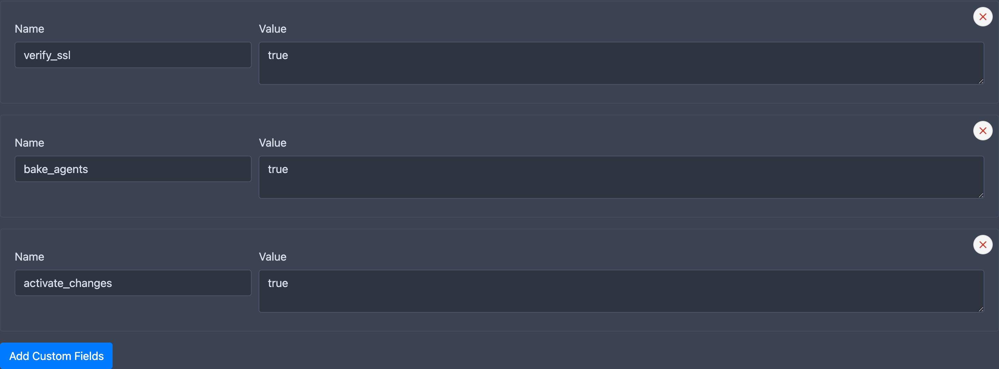
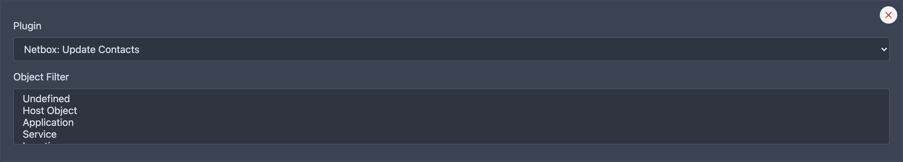

# Accounts

An **Account** is the central configuration unit in CMDBsyncer. Every external system the syncer communicates with — whether as an import source or an export target — requires exactly one account. The account holds all the connection details, credentials, and behavior settings for that system.

Without an account, no data can be read from or written to an external system. This applies to every supported integration: Checkmk, Netbox, Jira, REST APIs, CSV files, and all others.

You will find the account settings under **Settings → Accounts** in the navigation.

## Basic Fields

| Field         | Description                                                                      |
| :------------ | :------------------------------------------------------------------------------- |
| Name          | Reference name for the account, also used on the command line                    |
| Type          | Account type — controls which fields and validation apply                        |
| Is Master     | This account can overwrite data from other accounts on import                    |
| Restrict to   | Limit the account to import only or to inventorize only (see below)              |
| Is Object     | Imported entries are stored as Objects, not Hosts (see below)                    |
| Object Type   | Classifies the object type for filtering and special behaviors                   |
| Address       | URL or hostname of the target system                                             |
| Username      | Login username for the account                                                   |
| Password      | Password or API secret for the account                                           |
| Custom Fields | Additional plugin-specific fields (appear after the first save, if applicable). Each field explains itself in the form: the line under it says what it configures |

!!! tip
    Not every field is required for every integration. An API account typically only needs **Name**, **Address**, and **Password** (as the API token).

## About Objects and Object Types

By default, every imported entry is stored as a **Host**. Setting the **Is Object** flag changes this: the entry is stored in the Objects view instead and will not be exported to other systems as a host. However, all attributes of objects remain available in rules and can be referenced there.

This is useful for configuration items that are not hosts themselves — for example, locations, contracts, or clusters — but whose attributes you want to use in your rules.

### Object Types

Object types are assigned during import and serve two purposes:

- They allow you to filter which objects are used in a specific export.
- Some types have additional behavior: if the type is set to **Host**, any imported entry with an invalid hostname is rejected and logged as an error rather than saved silently.

### Restrict to Import or Inventorize

Most integrations can be used in two directions: **import** creates and owns hosts, **inventorize** only adds data to hosts that already exist. **Restrict to** limits an account to one of them:

- **No restriction** (default): the account can be used for both.
- **Only Import**: every inventorize run with this account stops with a message and writes nothing.
- **Only Inventorize**: the account cannot import hosts of its own. The run stops with an error before the first host is written.

Use it for an account that should only enrich hosts another system owns, or to make sure a cron entry that was pointed at the wrong command cannot quietly create hosts. The setting applies to every plugin and to the CLI, the cron jobs and the API alike.

### Import name checks

Two options under **Object Settings** control how strictly imported names are validated. Both apply per account and are ignored for object accounts (an object's name is not a real hostname):

- **Check for valid hostname** (on by default): reject imported hosts whose name is not RFC-valid.
- **Require FQDN** (off by default): reject imported hosts whose name is not a fully-qualified domain name (must contain a dot).

These replace the former global `CHECK_FOR_VALID_HOSTNAME` and `REQUIRE_FQDN` local config settings; `cmdbsyncer sys self_configure` warns you to migrate if either is still set in `local_config.py`.

## Additional Configurations



Some account types (e.g. CSV or JSON) require additional plugin-specific fields that are not shown by default. Simply save the account once — the relevant fields will appear automatically afterwards.

### Documentation by Account Type

- [Checkmk](../checkmk/accounts.md)
- [Netbox](../netbox/account.md)
- [Jira](../jira/index.md)
- [Inventorize Options](host_labels_inventory.md#account-options-for-inventorize)

### Global Options

**`delete_host_if_not_found_on_import`**

Enter a Mongoengine filter in the format `fieldname:value` to automatically delete hosts that are no longer part of an import. Multiple filters can be combined with `||` (logical AND). See the [Mongoengine filter documentation](https://docs.mongoengine.org/guide/querying.html) for the full syntax.

## SSL Certificate Verification

!!! warning "Security Notice"
    SSL certificate verification protects your connections from man-in-the-middle attacks. Always keep verification enabled in production environments.

By default, CMDBsyncer verifies the SSL certificate of every account connection. If your environment uses a **custom CA (Certificate Authority)** — for example an internal company CA or a self-signed certificate — you must provide the CA certificate files so the syncer can establish a trusted connection.

### Fields

These fields are configured as custom fields on the account record. The names below are the exact keys the syncer reads.

| Field            | Description                                                                                    |
| :--------------- | :--------------------------------------------------------------------------------------------- |
| `verify_cert`    | Enable or disable SSL certificate verification. Should always be enabled in production.        |
| `ca_cert_chain`  | Absolute path to the intermediate CA certificate file (PEM format) on the CMDBsyncer server.   |
| `ca_root_cert`   | Absolute path to the root CA certificate file (PEM format) on the CMDBsyncer server.           |

### How to configure

1. Upload your CA certificate file(s) via the [Fileadmin](fileadmin.md) — this is the easiest way to get the files onto the server without needing shell access.
2. Copy the full path shown in the Fileadmin for the uploaded file.
3. In the account settings, paste the path into **`ca_cert_chain`** and/or **`ca_root_cert`**.
4. Make sure **`verify_cert`** is enabled.

!!! tip "Upload via Fileadmin"
    The [Fileadmin](fileadmin.md) displays the full absolute path for every uploaded file — copy it directly into the certificate field.

CMDBsyncer will automatically merge the provided files into a temporary certificate bundle and use it for all requests made through this account.

!!! note
    Both certificate fields are optional. If your entire CA chain is contained in a single file, filling in only one field is sufficient.

## Request Timeout

By default, every HTTP request the syncer makes uses the global timeout (`HTTP_REQUEST_TIMEOUT`, 30 seconds). If a single target system responds slower — for example a large distributed Checkmk setup where downtime operations fan out to all sites — you can raise the timeout for just that connection.

Add a custom field named `request_timeout` to the account and set the value in seconds:

| Field             | Description                                                          |
| :---------------- | :------------------------------------------------------------------- |
| `request_timeout` | HTTP request timeout in seconds for this account (e.g. `300`). Overrides the global `HTTP_REQUEST_TIMEOUT` for all requests made through this account. |

## Custom Request Headers

Some target systems are not reached directly but through an API gateway, which wants a header of its own — an API key, a tenant or a correlation id — that the module itself knows nothing about. Every account carries a `custom_headers` custom field for them, whatever its type, and every HTTP request made through the account sends them.

The field is offered on the account form of every plugin type. An account created before the field existed gets it the next time it is saved.

Write the headers as `Name: value` pairs, separated by a pipe:

```
X-API-Key: abc123 | X-Tenant: muc
```

| Field            | Description                                                          |
| :--------------- | :------------------------------------------------------------------- |
| `custom_headers` | Extra headers for all requests of this account, as `Name: value` pairs separated by a pipe. |

The pipe separates instead of a comma because a header value may well contain one (`Accept: application/json, text/plain` is a single, valid pair). A pair without a colon is skipped and logged as a warning rather than sent as a broken header.

A header the module sets itself — `Accept` or `Content-Type` of its own API calls — keeps winning, so a custom header never breaks the module's own protocol.

The value must not be a secret in clear text: reference one that is stored encrypted instead, with the [account macro](#reference-fields) `{{ACCOUNT:<account name>:password}}`.

```
Authorization: Bearer {{ACCOUNT:gateway-key:password}}
```

Headers whose name looks like a credential (`Authorization`, `X-API-Key`, `X-Auth-Token`, `Cookie`, …) are masked in the debug log.

## Extra Plugin Options

In addition to the global account fields, each account can hold plugin-specific options. These allow you to configure behavior that applies only when the account is used for a particular action — even if the same account is reused across multiple operations.

### Object Filter

When set, the plugin only processes objects that match the specified object types for this operation.



## Reference Fields

You can reference any account field from within your configuration using the `{{ACCOUNT:...}}` macro. This allows you to avoid repeating credentials or to keep sensitive values out of rule definitions.

Syntax:

```text
{{ACCOUNT:<ACCOUNT_NAME>:<ACCOUNT_FIELD_NAME>}}
```

## Config Children

A **Config Child** is an account that inherits all settings from a parent account, but overrides the custom fields and plugin configuration.

This is useful when you need slightly different behavior for the same system — for example, different filters or export settings — without duplicating the entire account configuration.
