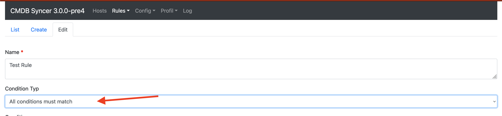
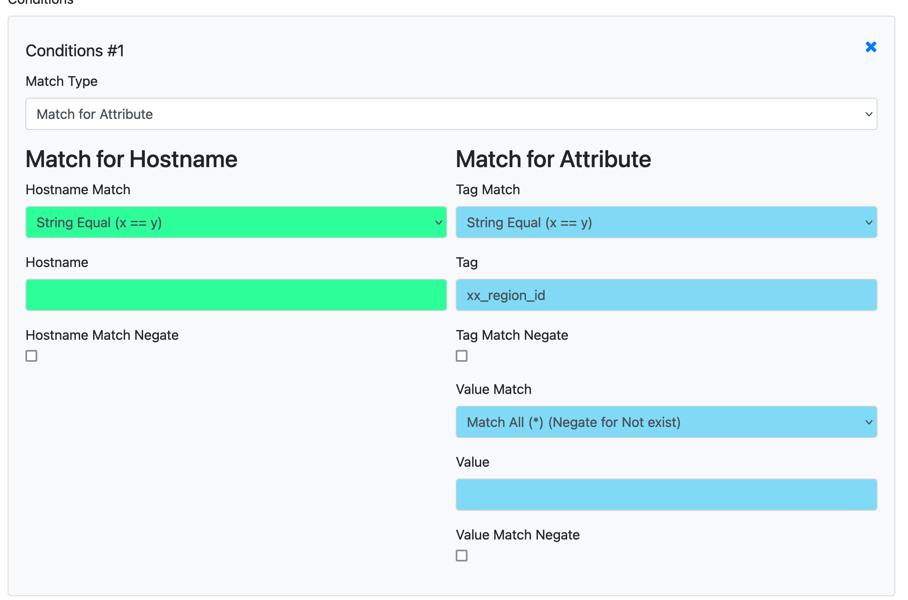

# Rule Conditions
Every Rule has a Condition. And you have the power to match everything. Hosts or attributes with different options.
Make sure to set for the Condition, if an Attribute or a Host match is required. Sadly, the Frontend always shows all input fields due to current limitations. Also, it's required to set how the conditions should be applied.

They can match "ANY", what means one matching condition will be enough for the rule to match. If set to "ALL", all conditions need to match. Put "Anyway" and the Rule will match without condition.

## Match FAQ

### Match if a Attribute does NOT exist on an object
 - Set `Tag Match` to `Match All (*)`, 
 - Set `Tag` to the Tag you don't want to exist, 
 - Set Checkbox `Tag Match Negate`
 - Value Match does not matter

### Match if a Attribute is empty
Hint: If you don't want to import Empty Attribute, you can set this with `LABELS_IMPORT_EMPTY=False`, in your local_config.py

- Set `Tag Match` to the desired Attribute Name
- Set `Value Match` to `Match All (.*)`
- Set Checkbox `Value Match Negate`
- Value Match can be empty.

