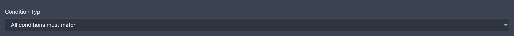
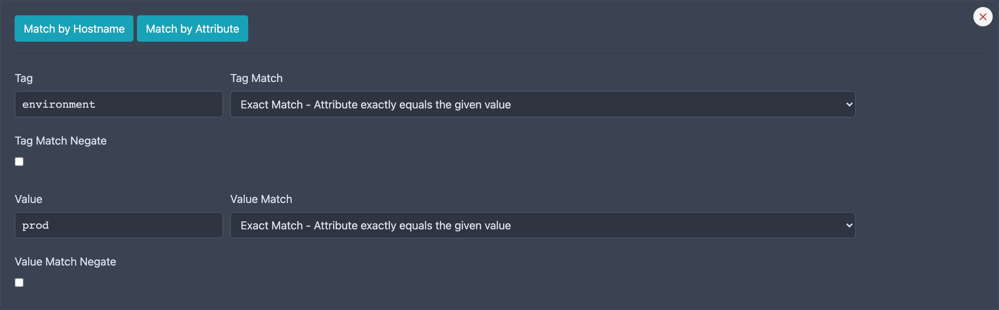

# Rule Conditions

Every rule has a condition section that controls which hosts the rule applies to. You can match by hostname or by attribute, with a wide range of comparison operators.

Set the **condition mode** at the top of the rule to control how multiple conditions are combined:

- **ANY** — one matching condition is enough for the rule to match
- **ALL** — every condition must match
- **Anyway** — the rule always matches, regardless of conditions

## Condition Types

All string-based conditions are case-insensitive, except `regex`.

| Condition Type   | Description                                                                         | Case Sensitive |
| :--------------- | :---------------------------------------------------------------------------------- | :------------- |
| `equal`          | Attribute exactly equals the given value                                            | No             |
| `in`             | Given string is contained in the attribute value (works with strings and lists)     | No             |
| `not_in`         | Given string is NOT contained in the attribute value (works with strings and lists) | No             |
| `in_list`        | Attribute value is found in your comma-separated list                               | No             |
| `string_in_list` | Your string is found in the attribute's Python/comma-separated list                 | No             |
| `swith`          | Attribute starts with the given string                                              | No             |
| `ewith`          | Attribute ends with the given string                                                | No             |
| `regex`          | Attribute matches the given regular expression                                      | Yes            |
| `bool`           | Attribute matches a boolean True/False value                                        | —              |
| `ignore`         | Always matches (negate to check that attribute does not exist)                      | —              |

Every condition can be **negated** with the corresponding negate checkbox, which inverts the match result.

## Match FAQ

### Match if an attribute does NOT exist on a host

- Set _Tag Match_ to `Match All (*)`
- Set _Tag_ to the attribute name you want to check
- Enable the _Tag Match Negate_ checkbox
- The value match does not matter

### Match if an attribute is an empty string

!!! note
    To prevent empty attributes from being imported at all, set `LABELS_IMPORT_EMPTY=False` in `local_config.py`.

- Set _Tag Match_ to the attribute name
- Set _Value Match_ to `String Equal`
- Leave the value field empty (that is the empty string)

### Match a key in a dictionary

If an attribute contains a dictionary (e.g. `{"status": "active", "env": "prod"}`), you can match against a specific key using the `in` condition type.

The `in` condition checks whether your string is contained in the string representation of the attribute value. For structured data, use a Jinja rewrite rule first to extract the key into a flat attribute, then match against that.

### Match using regex with capture groups

When using `regex`, you can reference the first matching value in rewrite rules via the special placeholder `{{FIRST_MATCHING_VALUE}}`. See [Rewrite Attributes](rewrite_attributes.md) for details.

### Use `in_list` vs `string_in_list`

These two types are often confused:

- **`in_list`**: Your rule provides the list. The host attribute is checked against whether it appears in your list. Example: host has `os=windows`, your list is `windows,linux,macos` → matches.
- **`string_in_list`**: The host attribute _is_ the list. Your rule provides the string to look for inside it. Example: host has `services=dns,dhcp,ntp`, your string is `dns` → matches.
