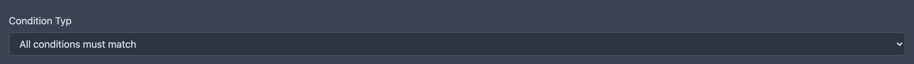
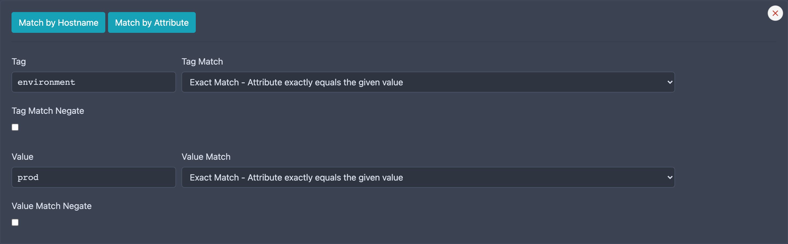

# Rule Conditions

Every rule has a condition section that controls which hosts the rule applies to. You can match by hostname or by attribute, with a wide range of comparison operators.

Set the **condition mode** at the top of the rule to control how multiple conditions are combined:

- **ANY** — one matching condition is enough for the rule to match
- **ALL** — every condition must match
- **Anyway** — the rule always matches, regardless of conditions

## Condition Types

All string-based conditions are case-insensitive, except `regex`.

| Condition Type   | Description                                                                         | Case Sensitive |
| :--------------- | :---------------------------------------------------------------------------------- | :------------- |
| `equal`          | Attribute exactly equals the given value                                            | No             |
| `in`             | Given string is contained in the attribute value (works with strings and lists)     | No             |
| `not_in`         | Given string is NOT contained in the attribute value (works with strings and lists) | No             |
| `in_list`        | Attribute value is found in your comma-separated list                               | No             |
| `string_in_list` | Your string is found in the attribute's Python/comma-separated list                 | No             |
| `swith`          | Attribute starts with the given string                                              | No             |
| `ewith`          | Attribute ends with the given string                                                | No             |
| `regex`          | Attribute matches the given regular expression                                      | Yes            |
| `bool`           | Attribute matches a boolean True/False value                                        | —              |
| `older_than`     | Attribute value is a timestamp older than the given age (`2d`, `12h`, `30m`, `1w`, plain number = days). Value match only | — |
| `newer_than`     | Attribute value is a timestamp not older than the given age (same notation). Value match only | — |
| `ignore`         | Always matches (negate to check that attribute does not exist)                      | —              |

Every condition can be **negated** with the corresponding negate checkbox, which inverts the match result.

### Older Than / Newer Than

Since version 4.4, two condition types compare an attribute holding a date against the clock instead of against your text. They are offered under _Value Match_ only: a hostname and an attribute name are never a date, so _Hostname Match_ and _Tag Match_ do not list them.

- The value field holds an age: a number followed by `m` (minutes), `h` (hours), `d` (days) or `w` (weeks). A number on its own counts days, so `2` is the same as `2d`.
- An age the Syncer cannot read (e.g. `two days`) raises an error that names the accepted notation, just like a broken regex.
- The Syncer stores its own timestamps in UTC and compares in UTC. A date imported from elsewhere may be an ISO string; one carrying a timezone offset is converted to UTC first.
- An attribute that is not a date never matches, in **either** direction. A host without the attribute falls through both an `Older Than` and a `Newer Than` rule.

!!! warning "Careful with negate"
    A negated `Older Than 2d` ("not older than two days") also matches every host that has no date at all. If you mean "seen within the last two days", use `Newer Than 2d` instead.

A rule that uses one of these conditions, or that renders `syncer_last_seen` / `syncer_last_sync` into a Jinja value, can change its answer while nothing about the host changes. Such a rule set is therefore never answered from the export cache; every other rule set stays cached as before.

## Built-in Attributes

Besides the host's labels, inventory and custom attributes, every rule can match on these attributes, which the syncer provides automatically:

| Attribute        | Description                                                                     |
| :--------------- | :------------------------------------------------------------------------------ |
| `SOURCE_ACCOUNT` | Name of the account the host was imported from (empty for manually created hosts) |
| `syncer_last_seen` | When an import last saw the host (UTC). Missing on hosts no import has seen yet |
| `syncer_last_sync` | When an import last changed the host (UTC). Missing on hosts no import has changed yet |

They are also available in Jinja values, e.g. `{{SOURCE_ACCOUNT}}`.

## Match FAQ

### Limit a rule to the hosts of one import account

If you import from several accounts (e.g. one per object type) and need different rules per account, use `SOURCE_ACCOUNT`:

- Set _Tag Match_ to `String Equal` and _Tag_ to `SOURCE_ACCOUNT`
- Set _Value Match_ to `String Equal` and the value to the account name, e.g. `jira-prod-vms`

This works in every rule type, including export rules, so an export can be restricted to the hosts of a single import account without relying on hostname patterns.

### Match hosts that were not seen for a while

Since version 4.4 no Jinja is needed for this. Switch a host off once an import has not seen it for two days, and on again as soon as it is back, with two rules — for example in the Checkmk rule _Set Folder and Attributes of Host_:

_Rule "switch off":_

- Match by attribute, _Tag Match_ `Exact Match`, _Tag_ `syncer_last_seen`
- _Value Match_ `Older Than`, value `2d`
- Outcome: e.g. Criticality `offline`

_Rule "switch on again":_

- Same condition, but _Value Match_ `Newer Than`, value `2d`
- Outcome: e.g. Criticality `prod`

Leave both negate checkboxes empty. Hosts without a `syncer_last_seen` match neither rule.

### Match if an attribute does NOT exist on a host

- Set _Tag Match_ to `Match All (*)`
- Set _Tag_ to the attribute name you want to check
- Enable the _Tag Match Negate_ checkbox
- The value match does not matter

### Match if an attribute is an empty string

!!! note
    To prevent empty attributes from being imported at all, set `LABELS_IMPORT_EMPTY=False` in `local_config.py`.

- Set _Tag Match_ to the attribute name
- Set _Value Match_ to `String Equal`
- Leave the value field empty (that is the empty string)

### Match a key in a dictionary

If an attribute contains a dictionary (e.g. `{"status": "active", "env": "prod"}`), you can match against a specific key using the `in` condition type.

The `in` condition checks whether your string is contained in the string representation of the attribute value. For structured data, use a Jinja rewrite rule first to extract the key into a flat attribute, then match against that.

### Match using regex with capture groups

When using `regex`, you can reference the first matching value in rewrite rules via the special placeholder `{{FIRST_MATCHING_VALUE}}`. See [Rewrite Attributes](rewrite_attributes.md) for details.

### Use `in_list` vs `string_in_list`

These two types are often confused:

- **`in_list`**: Your rule provides the list. The host attribute is checked against whether it appears in your list. Example: host has `os=windows`, your list is `windows,linux,macos` → matches.
- **`string_in_list`**: The host attribute _is_ the list. Your rule provides the string to look for inside it. Example: host has `services=dns,dhcp,ntp`, your string is `dns` → matches.
