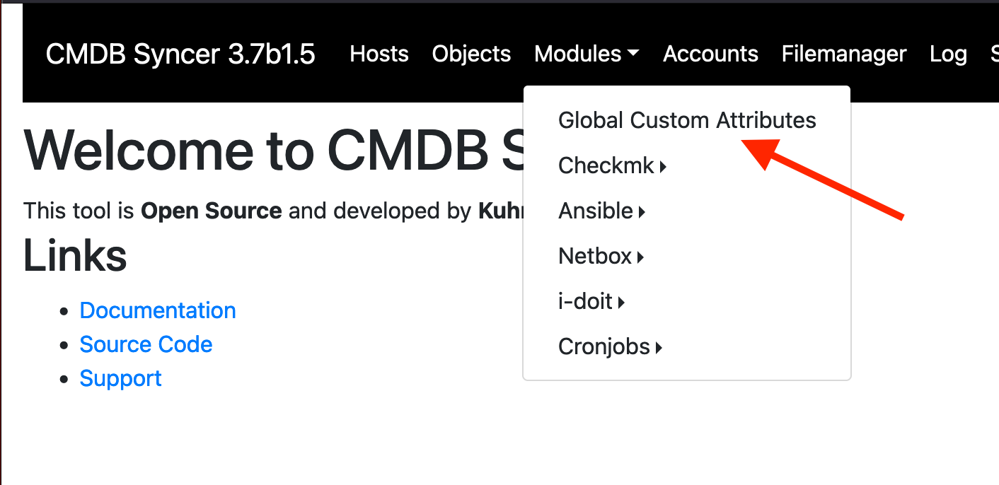
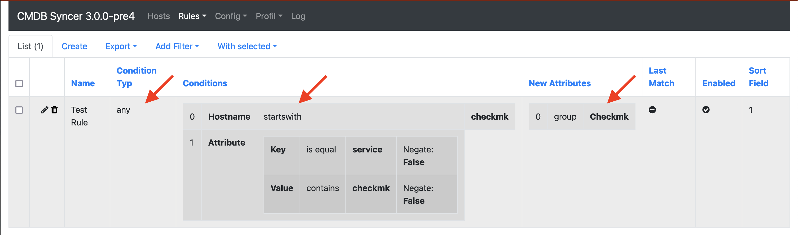
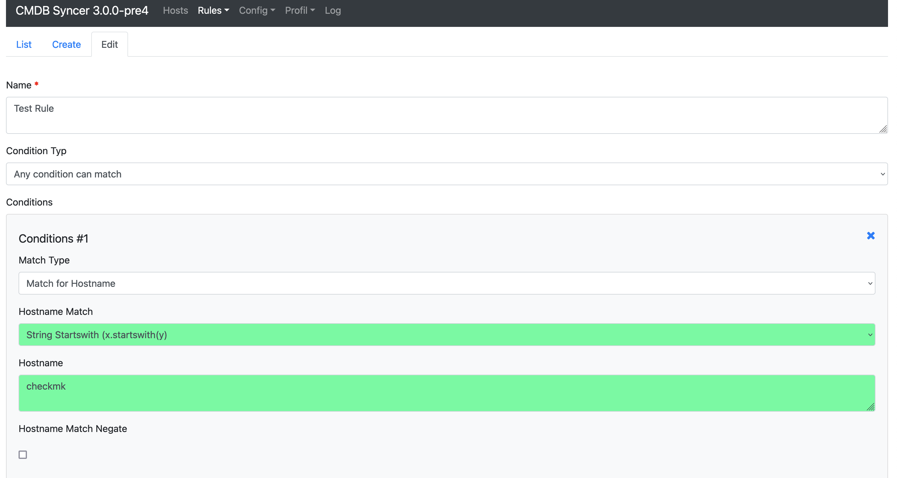
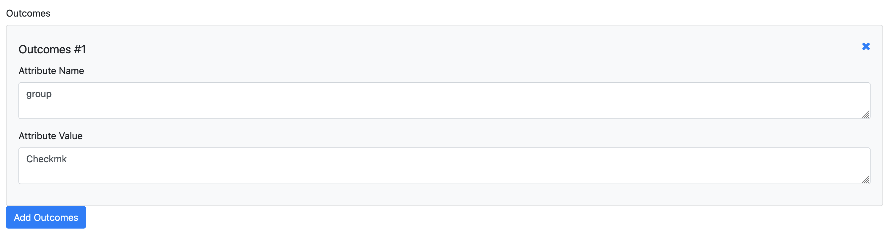

# No Data source is perfect

But there is a solution:
CMDB Syncer Supports the Rule-based assignment of new Attributes.

It's the first possible Rule and works for all other Modules:

It defines a condition and an outcome:

The Design of the Rule is like in every other rule, you define a [Condition](conditions.md).

Just the Outcome is special for every rule:

## Create real Custom Attributes with Rewrites

In the Module-Specific Rewrite Section, it is since Version 3.3 possible to create New labels using Templates. Please refer to the [Rewrite Attributes](rewrite_attributes.md) This is more powerful than this global option.

## Jinja Support in Custom Attributes

Since Version 3.12.1, the Outcome value of Custom Attribute rules supports Jinja templating. You can use all of the host's attributes and the `{{HOSTNAME}}` placeholder in the value field.

