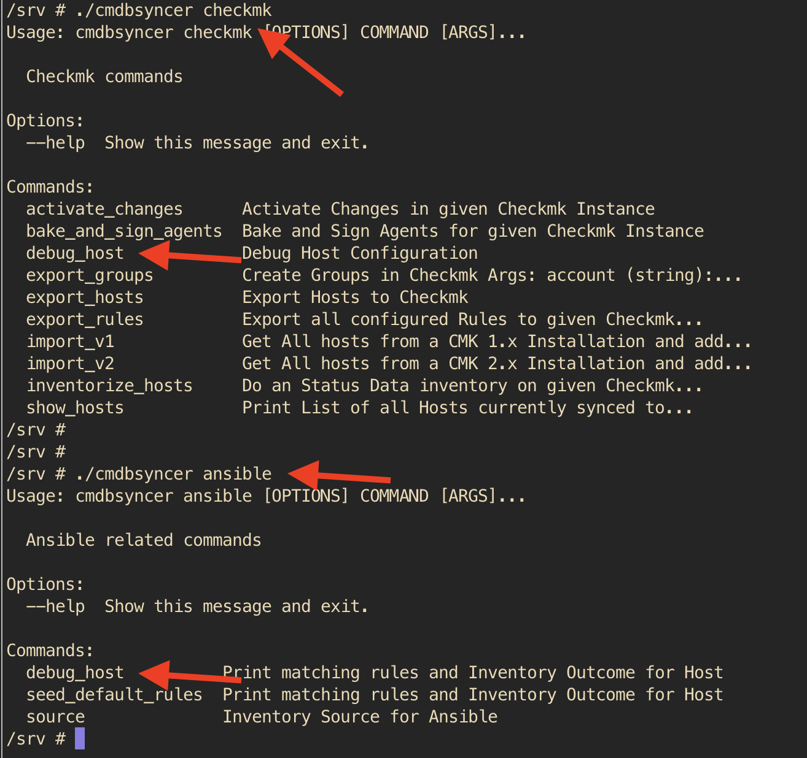
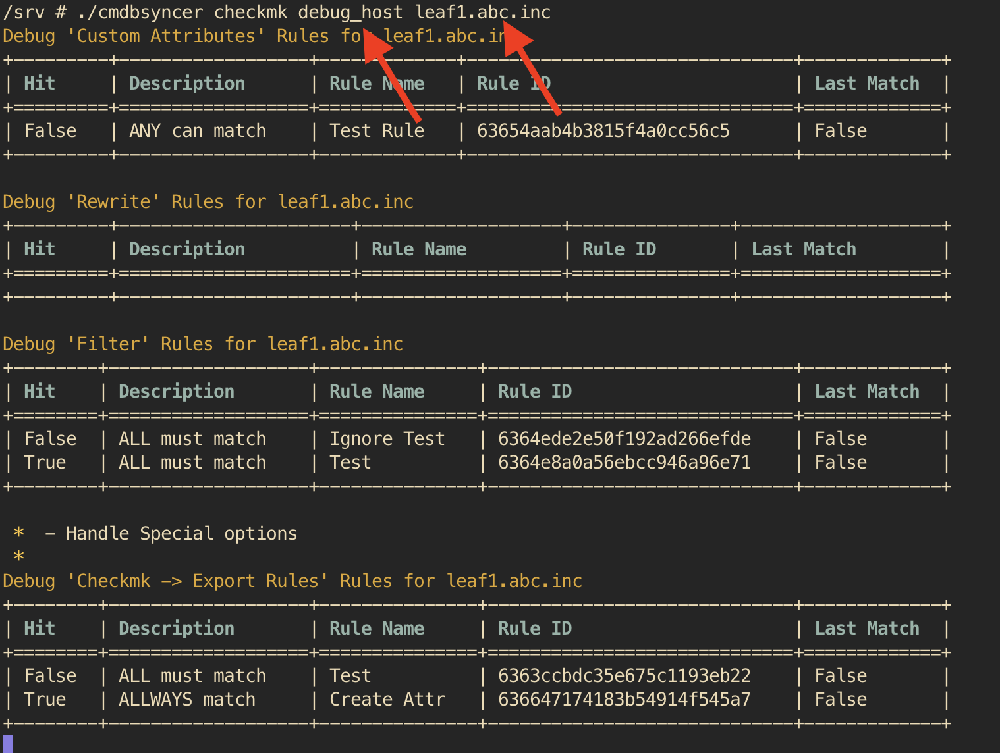

#Debug Rules
The options you have can lead to a complex outcome.
So, best is, to check this outcome on a set of hosts.

## From Version 3.8
Since Syncer 3.8, debug_host is deprecated. This is of all the new Export types which would lead to too many commands.

You now can simply add `--debug` and all Exceptions will Raise, and if you want to debug the outcome of the rules for a singe object, use the export command and add `--debug-rules=objectname`. You can combine that with `--debug` to let exceptions raise, but it's not required.
```

## Legacy before 3.8, deprecated
For that, every export module contains a debug_host option.
It's called in the CLI, by the Module as identifier.

See here the examples for Checkmk and Ansible:



If you then query a host, you see the tables with information about which Rules are applied and which attributes used;




