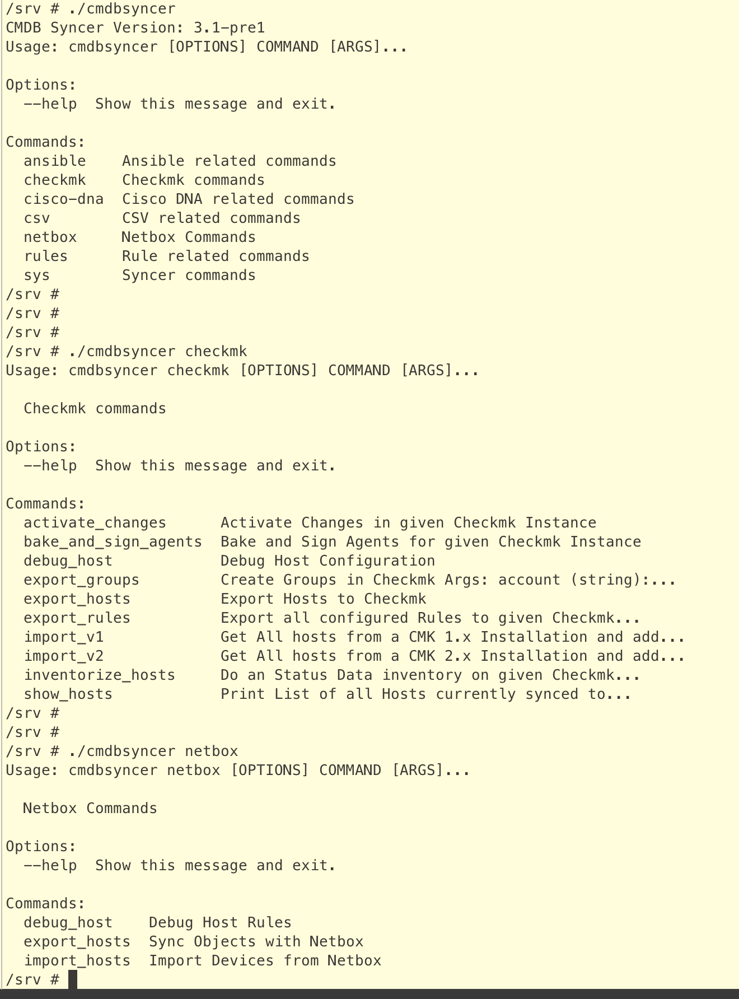

# First Steps

This page walks you through the essential setup steps after installation — from creating the first user to running your first sync.

!!! note "Docker vs. native"
    All `./cmdbsyncer` commands below run either directly in your shell (with the virtualenv activated) or inside the container:
    ```bash
    docker exec -it <container_name> ./cmdbsyncer <command>
    ```

---

## 1. Set Secret Keys

Before using the application, make sure `SECRET_KEY` and `CRYPTOGRAPHY_KEY` are set in your `local_config.py`.

- **`SECRET_KEY`** — signs the login session cookie. Can be changed at any time, but will log out all active users.
- **`CRYPTOGRAPHY_KEY`** — encrypts stored account passwords. **Never change this after you have saved passwords** — if changed, all stored passwords become unrecoverable and must be re-entered.

Both keys are generated automatically when you run:

```bash
./cmdbsyncer sys self_configure
```

Check and edit them in `local_config.py` in the project root. → [Full config reference](lcl_config.md)

---

## 2. Create the First User

```bash
./cmdbsyncer sys create_user mail@address.org
```

The command prints a generated password. Use it to log in to the web interface. Run the same command again at any time to reset a forgotten password or to unlock an account locked by 2FA.

---

## 3. Explore the Web Interface

After logging in, the navigation gives you access to all main areas:

- **Accounts** — configure connections to external systems
- **Rules** — define how attributes are transformed and which hosts are exported
- **Hosts / Objects** — view and search the syncer's host inventory
- **Log** — monitor sync runs and inspect errors
- **Cronjobs** — schedule automated sync jobs

---

## 4. Create an Account

Every external system requires an [Account](accounts.md) before you can import from or export to it. Go to **Accounts → Add** and fill in the connection details for your first system.

After saving, module-specific fields appear automatically if the selected type requires them.

---

## 5. Run Your First Import

Once an account is set up, trigger an import from the CLI to verify the connection and check what gets pulled in:

```bash
./cmdbsyncer <module> <import_command> --account=<account_name> --debug
```

For example, for a Netbox account named `my-netbox`:

```bash
./cmdbsyncer netbox import_devices --account=my-netbox --debug
```

After a successful import, the hosts appear under **Hosts** in the web interface.

---

## 6. Set Up Cron Jobs

For automated, recurring syncs, configure a **Cronjob Group** under **Cronjobs → Cronjob Group**. Add the import and export jobs in the order they should run. If one job fails, the group stops — this prevents exports from running with stale or missing data.

Then schedule the cron trigger on your system:

**Native installation:**

```bash
*/5 * * * * cd /opt/cmdbsyncer && source ./ENV/bin/activate && ./cmdbsyncer cron run_jobs
```

**Docker:**

```bash
*/5 * * * * docker exec <container_name> /srv/cmdbsyncer cron run_jobs
```

→ [Cron documentation](cron.md)

---

## 7. Explore the CLI

The CLI mirrors every function available in the web interface and adds debug capabilities. Commands are organized by module:



```bash
./cmdbsyncer --help
./cmdbsyncer checkmk --help
./cmdbsyncer checkmk export_hosts --help
```

Add `--debug` to any command to raise exceptions and enable verbose logging. Use `--debug-rules=<hostname>` to inspect rule outcomes for a specific host without writing anything to the target.

→ [Debugging documentation](debug_rules.md)
