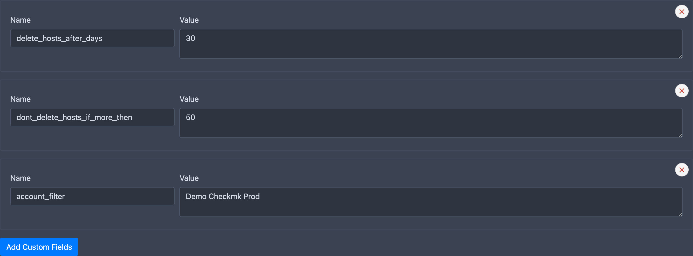

# Host Removal and Maintenance

When a host is no longer found by any import source, CMDBsyncer does not delete it immediately. Instead, the host is kept in the database with its `last_seen` timestamp frozen. The maintenance process periodically checks this timestamp and removes hosts that have been absent for longer than the configured grace period.

Removing a host from the CMDBsyncer database also triggers its deletion from all export targets on the next export run — for example, the host will be removed from Checkmk.


## Safety Mechanisms

Before any deletion happens, two safeguards apply:

- **`no_autodelete` flag** — individual hosts can be protected from automatic deletion by setting this flag on the host object. Templates are also never auto-deleted.
- **Deletion threshold** — if the number of hosts to be deleted exceeds a configured limit, the entire deletion run is aborted and an error is logged. This prevents mass deletions caused by a failing import.

## Setup: Maintenance Account

The recommended way to run maintenance is through a dedicated **Maintenance account** combined with a [Cron job](cron.md).

1. Go to **Accounts → Add**
2. Set the type to **Syncer Maintenance**
3. Configure the custom fields:

| Field                           | Description                                                                                       |
| :------------------------------ | :------------------------------------------------------------------------------------------------ |
| `delete_hosts_after_days`       | Grace period in days. Hosts not seen for longer than this will be deleted. Set to `0` to disable. |
| `dont_delete_hosts_if_more_then`| Safety threshold. If more hosts than this number would be deleted, the run is aborted.            |
| `account_filter`                | Name of another account. If set, only hosts imported by that account are considered for deletion. |

1. Create a Cron job using the **"Syncer: Maintenance"** job with this account.



## Running Maintenance Manually

From the CLI, without an account:

```bash
./cmdbsyncer sys maintenance 7
```

This deletes all hosts not seen in the last 7 days. The number is the grace period in days.

With an account (uses the account's configured settings):

```bash
./cmdbsyncer sys maintenance --account=my-maintenance-account
```

## Account Filter

The `account_filter` field restricts deletion to hosts that were last imported by a specific account. This is useful when you have multiple import sources and only want to clean up hosts from one of them — for example, to avoid deleting hosts that are exclusively managed by a different source.

## Next Steps

- [Set up Cron jobs to automate maintenance](cron.md)
- [Export documentation](export.md)
