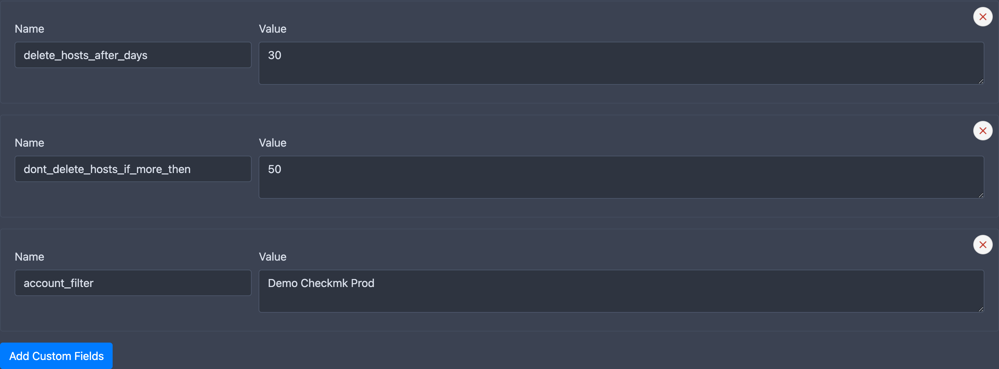

# Host Removal and Maintenance

When a host is no longer found by any import source, CMDBsyncer does not delete it immediately. Instead, the host is kept in the database with its `last_seen` timestamp frozen. The maintenance process periodically checks this timestamp and removes hosts that have been absent for longer than the configured grace period.

Removing a host from the CMDBsyncer database also triggers its deletion from all export targets on the next export run — for example, the host will be removed from Checkmk.


## Safety Mechanisms

Before any deletion happens, two safeguards apply:

- **`no_autodelete` flag** — individual hosts can be protected from automatic deletion by setting this flag on the host object. Templates are also never auto-deleted.
- **Deletion threshold** — if the number of hosts to be deleted exceeds a configured limit, the entire deletion run is aborted and an error is logged. This prevents mass deletions caused by a failing import.

## Setup: Maintenance Account

The recommended way to run maintenance is through a dedicated **Maintenance account** combined with a [Cron job](cron.md).

1. Go to **Accounts → Add**
2. Set the type to **Syncer Maintenance**
3. Configure the custom fields:

| Field                           | Description                                                                                       |
| :------------------------------ | :------------------------------------------------------------------------------------------------ |
| `delete_hosts_after_days`       | Grace period in days. Hosts not seen for longer than this are archived. Set to `0` to disable.    |
| `dont_delete_hosts_if_more_then`| Safety threshold. If more hosts than this number would be archived, the run is aborted.           |
| `account_filter`                | Name of another account. If set, only hosts imported by that account are considered.              |
| `purge_archived_after_days`     | Days a host may stay in the archive before it is permanently deleted. Defaults to `30` if unset; set to `0` to keep archived hosts forever. |

1. Create a Cron job using the **"Syncer: Maintenance"** job with this account.



## Permanent Deletion of Archived Hosts

Archiving is only the first stage: a host that is no longer found is
soft-deleted and moved to the **Archive**, where it can still be reviewed and
restored. The maintenance run also cleans up the archive itself — hosts that
have been archived for longer than `purge_archived_after_days` (default **30
days**) are then permanently deleted and can no longer be restored.

This applies to every archived host, including ones you removed manually in the
UI. Protected hosts (`no_autodelete`) and templates are never purged. Set
`purge_archived_after_days` to `0` to keep archived hosts indefinitely.

## Running Maintenance Manually

From the CLI, without an account:

```bash
./cmdbsyncer sys maintenance 7
```

This deletes all hosts not seen in the last 7 days. The number is the grace period in days.

## Database Size

To see what occupies the space in MongoDB:

```bash
./cmdbsyncer sys db_stats
```

It prints the database totals and every collection with its document count,
data size, size on disk and index size, biggest first. `--indexes` adds the
size of each index, `--collection <name>` lists the largest documents of one
collection. Collections that keep growing — the run log, the label history,
the audit log, the Ansible run history and the inventory trees — are pointed
out below the table.

## Retention

Every collection that gets one document per run, per host or per decision has
an upper bound. MongoDB drops the expired documents itself through a TTL index,
so there is no cleanup job that can be forgotten:

| Setting | Applies to | Default |
| --- | --- | --- |
| `LABEL_HISTORY_RETENTION_DAYS` | Label history (Timeline tab) | 90 |
| `ANSIBLE_RUN_STATS_RETENTION_DAYS` | Ansible run history, including each run's log | 90 |
| `FIELD_APPROVAL_RETENTION_DAYS` | Decided field approvals | 365 |
| `AUDIT_RETENTION_DAYS` | Audit log | 365 |
| `APPROVAL_RETENTION_DAYS` | Decided approval-queue entries | 365 |

Entries still waiting for a decision are never dropped — they carry no decision
date for the retention to work from. A value of `0` is read as one day; there
is no "keep forever".

Run `./cmdbsyncer sys self_configure` after changing one of these — that is
where the TTL index is updated. It also removes the stored inventory trees of
hosts that no longer exist.

`AUDIT_IMPORT_LABEL_CHANGES` (default off) decides whether label changes made
by an import reach the audit log. Leave it off where an import rewrites labels
on every run: it would write one entry per host per run and bury the changes
people made.

## Label History

The **Timeline** tab of a host records who changed which label when. It is
**off by default**: every host save that changes labels writes an entry, so on
installations whose import rewrites labels on every run it becomes the largest
collection in the database.

Switch it on under *Config → Local Config → Label history*:

| Setting | Meaning |
| --- | --- |
| `LABEL_HISTORY_ENABLED` | Record label changes (default `False`) |
| `LABEL_HISTORY_RETENTION_DAYS` | Days an entry is kept (default `90`, minimum `1`) |

The retention is enforced by MongoDB itself through a TTL index. Run
`./cmdbsyncer sys self_configure` after changing the number of days — that is
where the index is updated.

To find out what a history is costing and what fills it:

```bash
./cmdbsyncer sys label_history
```

The breakdown by label key answers the usual question: which label is rewritten
on every import. Fix that label (or leave the history off) and the growth stops.

To clean up — including the history written by versions before 4.3, which had
no retention:

```bash
./cmdbsyncer sys purge_label_history               # dry run
./cmdbsyncer sys purge_label_history --apply       # delete beyond the retention
./cmdbsyncer sys purge_label_history --all --apply # drop it completely
```

Deleting entries leaves the space reserved by MongoDB for reuse; only `--all`
(a collection drop) or a manual `compact` returns it to the filesystem.

## Account Filter

The `account_filter` field restricts deletion to hosts that were last imported by a specific account. This is useful when you have multiple import sources and only want to clean up hosts from one of them — for example, to avoid deleting hosts that are exclusively managed by a different source.

## Next Steps

- [Set up Cron jobs to automate maintenance](cron.md)
- [Export documentation](export.md)
