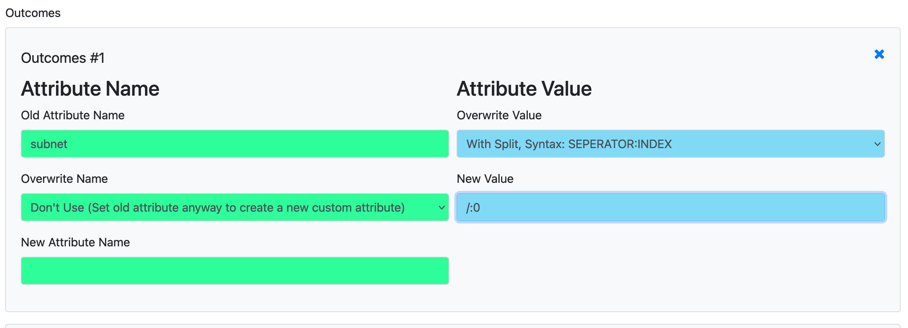

# Rewrite Attributes

Different targets have different needs in how the name of an attribute have to be. Specially if you want to control Ansible our set custom Checkmk Attributes.

To cover that, you can rewrite Attributes for every Module. 



So for example if you import an attribute like the ipaddress from a CSV, there will be an prefix like csv_ipaddress. With this rule you could rename it to just ip_address.

## Operations

### For Attribute Names

| Function                        | Description                                                                                |
| ------------------------------- | ------------------------------------------------------------------------------------------ |
| `Don't Use`                     | Just set Old Attribute Name, it will create a new Attribute out of it                      |
| `Overwrite with fixed String`   | String set in 'New Attribute Name' will overwrite the one given in 'Old Attribute Name'    |
| `Overwrite with Jinja Template` | Attribute Name is built with Jinja, you can use all of the Hosts Attribute or {{HOSTNAME}} |
| `Convert List of Strings`       | See Description below                                                                      |

#### Convert List of String
This function can create multiple new Attributes, out of a list either in a other Attribute or build using Jinja.

To set it up, enter in "Old Attribute Name" the Attribute you get the information from.
The Content of this attribute can be used as {{result}} in the Field "New Attribute Name".
If the Content is already a list like:
``` python
['one_service', 'another_service']
```
you are good to go. If not, use Jinja to archive that outcome.

An Example for a prefix would look like this:
``` python
[ 'my_prefix/{{label}}',]
```
Please note, that Jinja is used, to build a String, looking like a list again. Therefore the Brackets around and the ticks with the comma.

Now just set for the Value for example the Operation "To String" and the "New Value"
to yes.

Now you will get tow Attributes:
- one_serive: yes
- another_service: yes

### For Attribute Values

| Function              | Description                                                         |
| --------------------- | ------------------------------------------------------------------- |
| `To String`           | Overwrite the new or old Attribute with a fixed String              |
| `With Split`          | Use performant Python Split to rewrite value, see description below |
| `With Jinja Template` | User Jinja with all the hosts Attributes to rewrite the value       |

#### Split
Add a pattern to the field. This Pattern contains a seperator where you want to split the string,
and then the index for the result.

Example:
```
/:0
```

Split example 127.0.0.1/24:
The String would split at /, result would ['127.0.0.1', '24']
From there it would pick the first (0) index, new value would be: 127.0.0.1

## Create a New Attribute
If you specify a not existing attribute as "old_attribute_name", it will be created as a new Attribute. Of course, all Overwrite Options can be used for the value, so you could create a new
attribute which contains the value of multiple other attributes.


