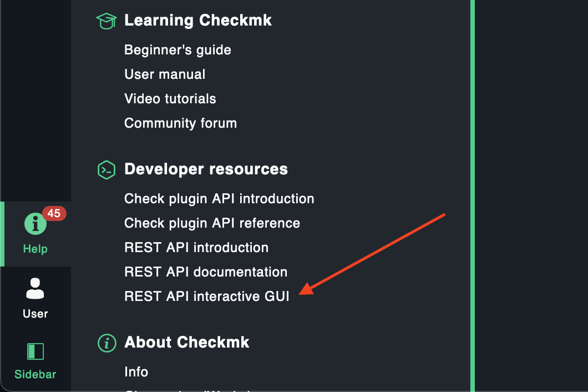
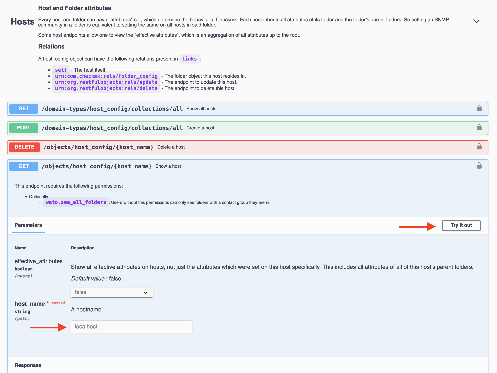
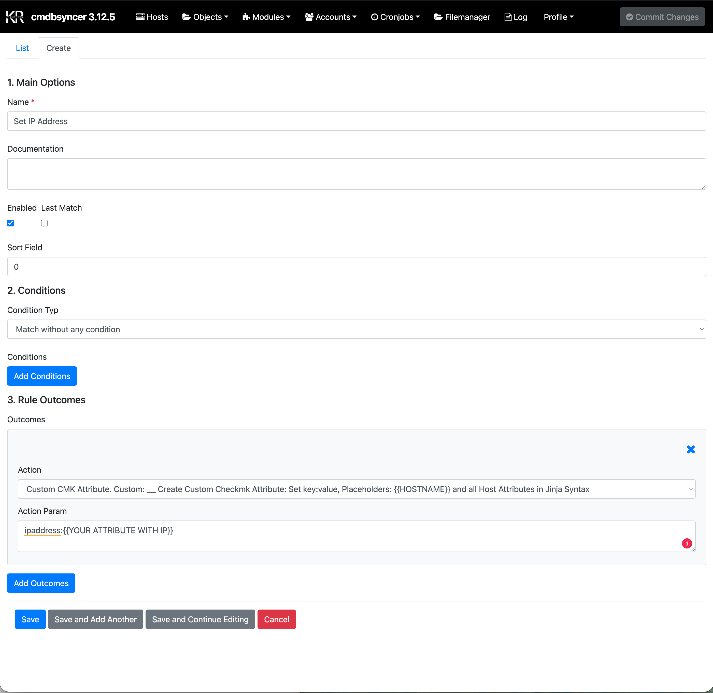
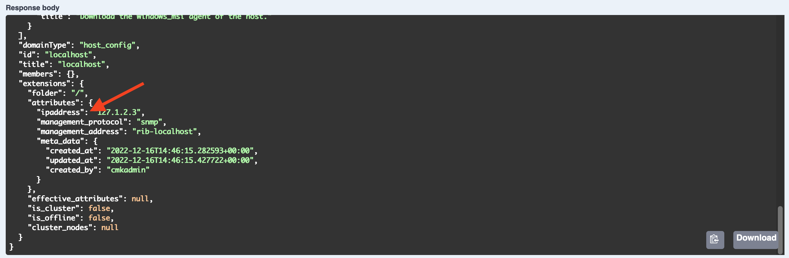
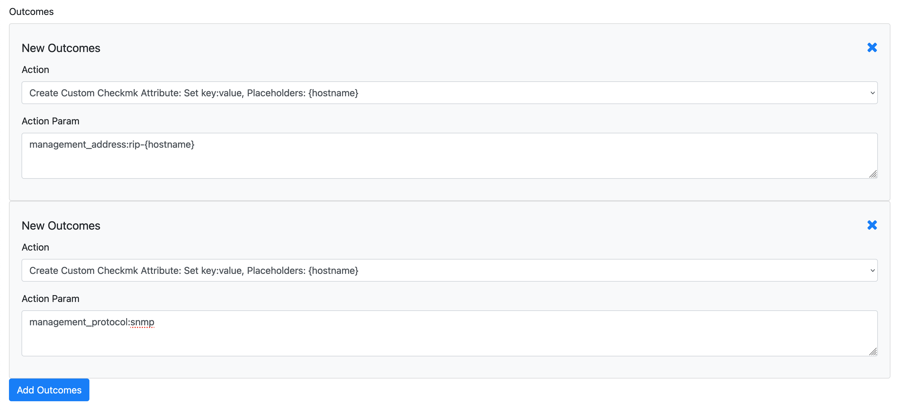
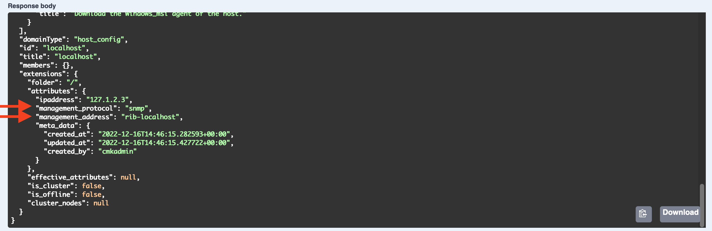

# Checkmk Attributes and Host Tags

The Syncer can set any Checkmk host attribute — including built-in attributes like IP address, management board, and SNMP community, as well as custom host tags.

All of this is configured in: _Modules → Checkmk → Set Folder and Attributes of Host_

## Finding the Attribute Name

If you do not know the exact attribute name, set the attribute manually on a host in Checkmk and then query that host via the Checkmk Swagger API.

Open the Swagger documentation:



Find and test the host endpoint:



The response JSON shows you the attribute names as used by the API.

## Setting an IP Address
You can create it using the **Custom CMK Attribute** action 



Because in the Checkmk API, the attribute looks like this:



## Setting the Management Board

Use the **Custom CMK Attributes** action to create attributes with a value derived from the hostname:



In Checkmk, the management board requires two attributes — make sure to add both as separate outcomes in the same rule.



## Setting Nested Attributes (e.g. SNMP Community)

Some Checkmk attributes are dictionaries. The Syncer detects this format and sends it correctly. Example for SNMP community:

```text
snmp_community:{
"type": "v1_v2_community",
"community": "public"
}
```

Note that the key (`snmp_community`) does not use quotes in this syntax.

## Unsetting an Attribute

If the value of an attribute is `None` or `False`, the Syncer automatically removes it from the host in Checkmk. However, the Syncer does not remove an attribute simply because it has disappeared from its own database — since Checkmk users can also set attributes manually, the Syncer cannot tell whether an attribute was set by it or by a user.

Use the **Remove given Attribute if not assigned** action in export rules to explicitly manage attribute cleanup.

## Host Tags

Host tags are attributes in Checkmk too — they use their tag group ID as the attribute key. Set them the same way as any other attribute using the CMK Attribute action.

For managing the tag group definitions themselves (the list of possible values), see [Host Tags](create_hosttags.md).
