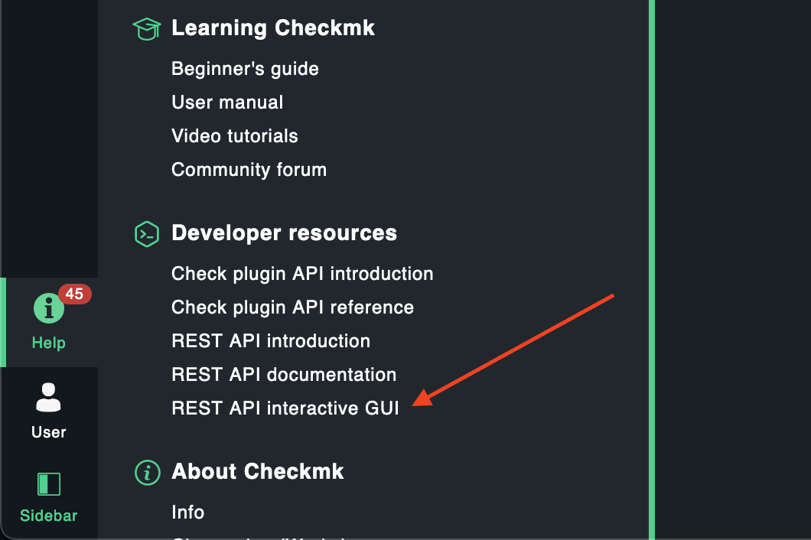
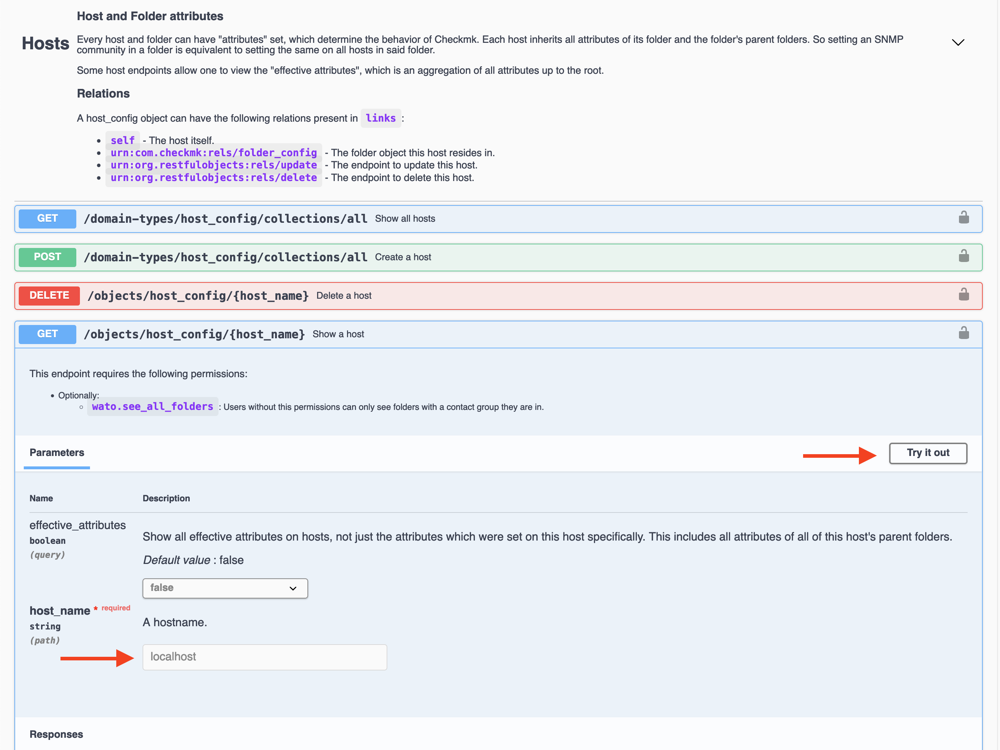
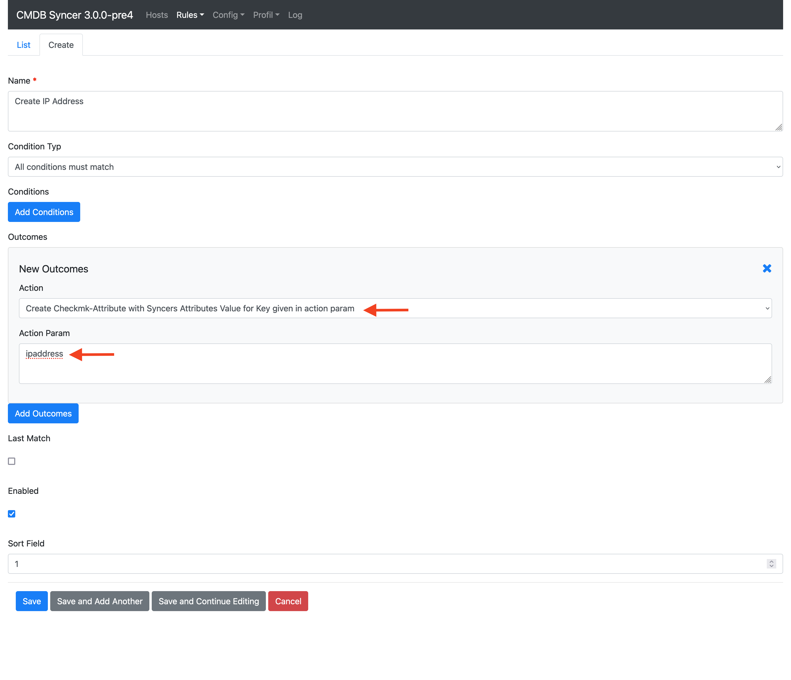
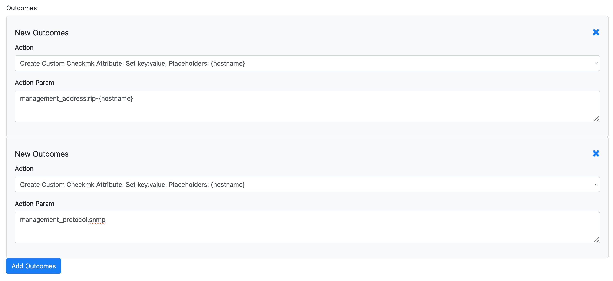

# Set all Kinds of Attributes to Checkmk

If you'd like to, you can set a rule to convert Syncer Attributes into Checkmk Attributes, or even just create your Custom ones using Placeholders. Only the Name needs to match the required Checkmk Name. To make that sure for existing Attributes, you can rewrite them using a rule in CMK → Rewrite Attributes. 

The Easy way to find out this Attribute's Name, is to check with the Swagger Documentation provided in Checkmk.

It's also possible to set Host Tags this way, because a Host Tag is nothing other then a Attribute in Checkmk.

Let's do some Examples.
The Rule for everything is **Checkmk → CMK Export Rules**.

## Where to find the Attribute Name for Checkmk
If you don't know the name already, just set a Host manually with this attribute and query it using Swagger Documentation.
Here is an Example how to do that:

Open Swagger:


Find and Test Endpoint:




## How to Unset an Attribute

If the Value of an Attribute is `None` or `False`, the Syncer automatically removes the Attribute in Checkmk. But the syncer will not remove attributes, if it's just disappeared in his Database. The Reason for that is because in Checkmk every user can also set attribute.  Therefore, the Syncer would not know whether this was an Attribute set by him or not. 


## Examples

### Setting an IP Address Attribute
To use an existing Syncer Attribute, which either already have the correct name ipaddress, or is rewritten to this name, use the "Create Checkmk-Attribute" Action like this:



In the Checkmk API, it would look like this:


### Setting Management Boards as Attributes
For this, you can create Custom Attributes. If for example all your physical hosts, have a DNS name for the Management Board which contains the actual Hostname, you can do it like this:


Here the Hostname could be srvlx100, the management Board rib-srvlx100.

In addition, please note the Second Outcome, since the Management Boards require at least to settings.

And here how to find this example in the CMK API:


### Setting nested attributes like SNMP Community.
Sometimes you will see that attributes you want to set are in the form of a Dictionary, example the SNMP Community:

``` json
"snmp_community": {  
	"type": "v1_v2_community",  
	"community": "public"  
}
```

Good news, the Syncer can detect that format to, converts it and will send it to Checkmk.
Just set it like this as a custom Checkmk Attribute

```
snmp_community:{
"type": "v1_v2_community",
"community": "public"
}
```

Please note that for the Key Name, no Ticks are used.