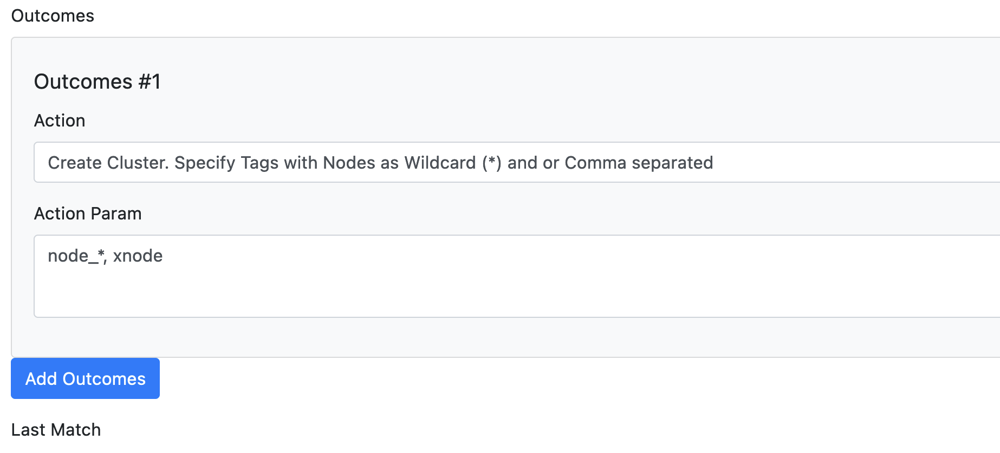

# Create Cluster Hosts

With the **Cluster** action in [Export Rules](export_rules.md), the Syncer can create Checkmk cluster hosts instead of normal hosts.

## How It Works

Cluster hosts in Checkmk require a list of node hostnames. The Syncer reads these node names from host attributes. You specify which attributes contain the node hostnames directly in the export rule.

The attribute specification supports:

- **Exact names** — `node_attribute_1, node_attribute_2`
- **Wildcards** — `node_*` matches all attributes starting with `node_`
- **Mixed** — `node_primary, node_backup_*`

Since cluster nodes must already exist in Checkmk before a cluster can reference them, cluster hosts are always created at the end of the export run.

Apart from cluster-specific behavior, all other Syncer rules apply normally — folder assignment, attribute setting, opt-outs, and labels all work the same as for regular hosts.

## Getting Node Attributes

Node information typically comes from your CMDB import. If your source does not provide it directly, you can add it using the [CSV module](../csv/index.md) or [Custom Attributes](../basics/custom_attributes.md).

## Example

The screenshot below shows an export rule with the Cluster action and multiple node attributes using a wildcard:

No special export command is needed — cluster hosts are included in the regular `export_hosts` run.
