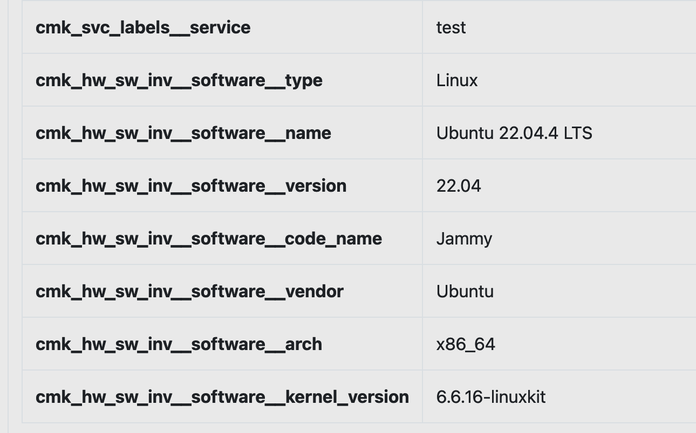

# Checkmk Inventorize 
The Syncer has the Function [Inventorize](../basics/host_labels_inventory.md). This is available to most of the Modules. Here describted is the Checkmk Inventorize Function. Because this Function supports a Web Based Configuration.

**Modules -> Checkmk -> Inventorize from Checkmk Settings**

The Default will already import all cmk Labels. In The Screenshot, you see an example how you inventorize a Service directly, and how to Access HW/SW Inventory Data of Checkmk.:

## Example Services

If you want to get either the Plugin Output, or the Service Labels, in both cases you need to configure the exact Service Name. Regex is possible only for Labels.

## Example Labels
You can use a Wildcard (\*) to filter the Labels you would like to get from the hosts.

## Example HW/SW Inventory

Since the HW/SW Inventory can contain a vast amount of data, it is not inventorized per default.
Also, you need to set the inventory tree you want to get.
In This Example, we get the Operating System Data.

To get the Network Interfaces, you would use:

`network.interfaces`

This would result in:

###  How to get Checkmk's HW/SW Inventory Data names

First figure out what you need, and export the Inventory as JSON:

In this JSON you now find the Keys:
software and os. That Leads to the sofware.os in the Configuration

So as result this would be `software.os`

This logs like:

## Commandline
To run the inventorize from the commandline, run this command:

_./cmdsyncer checkmk inventorize_hosts ACCOUNT_
