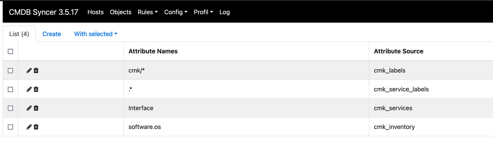
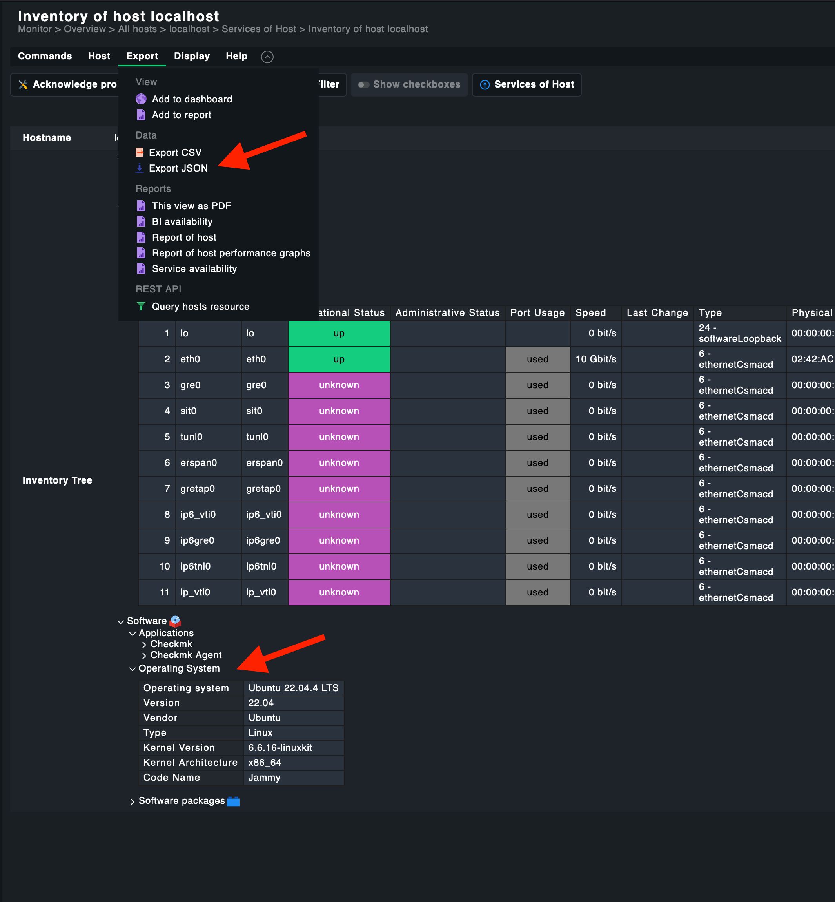
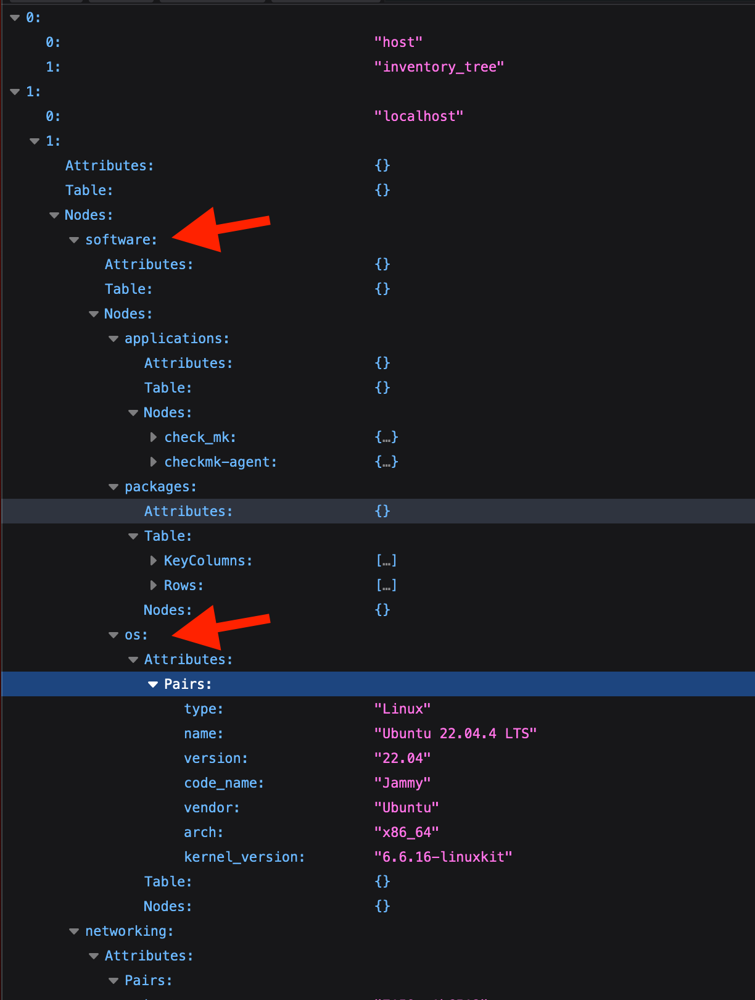

# Checkmk Inventorize 
The Syncer has the Function [Inventorize](basics/host_labels_inventor.md). This is available to most of the Modules. Here describted is the Checkmk Inventorize Function. Because this Function supports a Web Based Configuration.

**Rules -> Checkmk -> Inventorize Settings**

The Default will already import all cmk Labels. In The Screenshot you see an example how you inventorize a Service directly, and how to Access HW/SW Inventory Data of Checkmk.:

## How to get Checkmk's HW/SW Inventory Data
Since the HW/SW Inventory can contain a vast amount of data, it is not inventorized per default.
Also, you need to set the inventory tree you want to get.
In This Example, we get the Operating System Data.

First figure out what you need, and export the Inventory as JSON:

In this JSON you now find the Keys:
software and os. That Leads to the sofware.os in the Configuration

And after you run the 

_./cmdsyncer checkmk inventorize_hosts ACCOUNT_

you get this in your Attributes:

