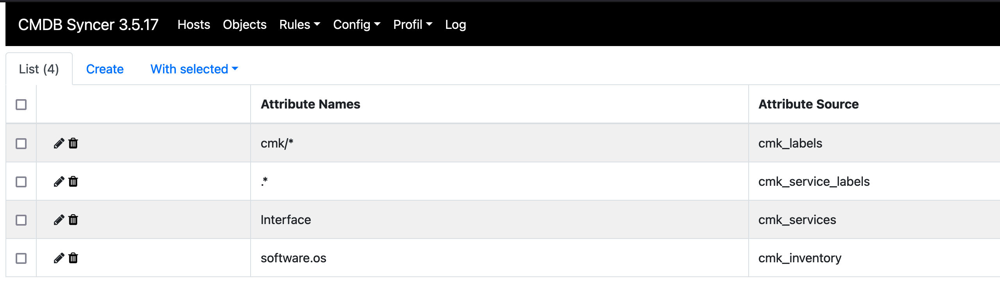
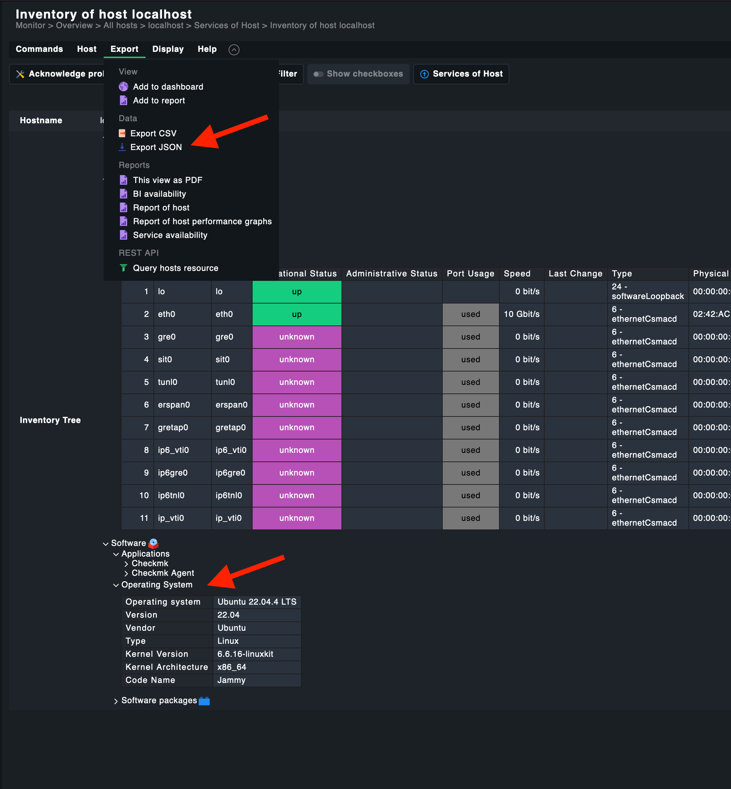
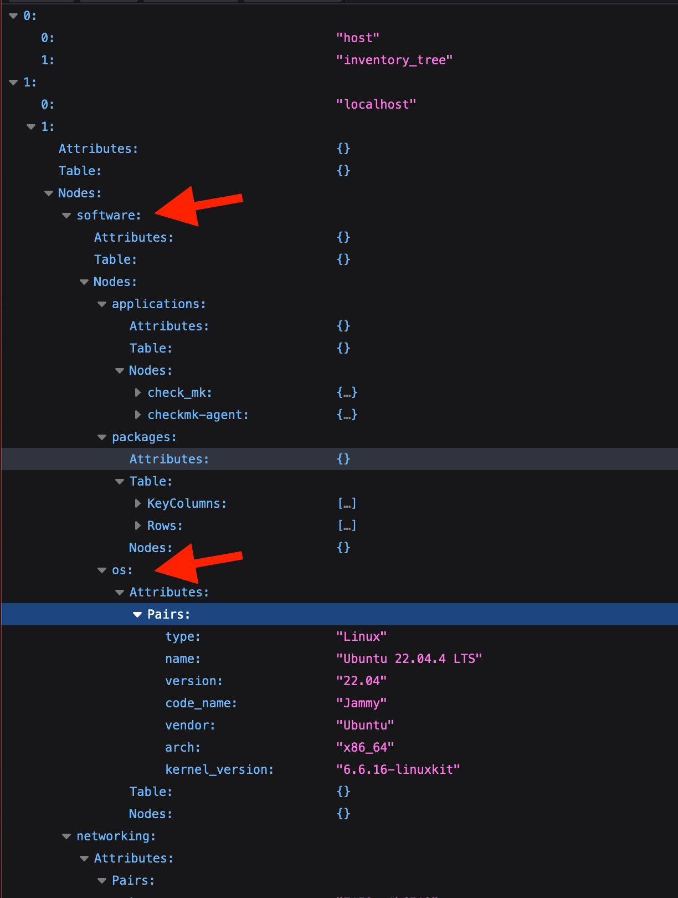
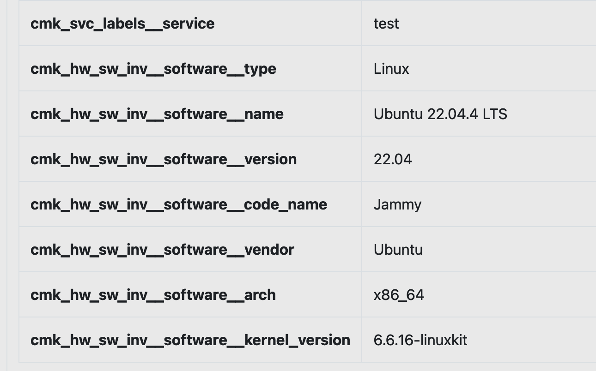

# Inventorize from Checkmk

The Syncer can read data back from Checkmk and store it as inventory attributes on hosts. This includes Checkmk labels, service plugin output, service labels, and HW/SW inventory data.

Go to: _Modules → Checkmk → Inventorize from Checkmk Settings_

The default configuration already imports all Checkmk host labels. The screenshot below shows an example of inventorizing a service and accessing HW/SW inventory data:



## Labels

Use a wildcard `*` to import all labels, or specify a pattern to filter:

```text
cmk/*
```

This imports only labels whose key starts with `cmk/`.

## Services

To import service data, specify the exact service name. For service labels, regex patterns are also supported.

## HW/SW Inventory

Checkmk's HW/SW inventory tree is organized in a dot-notation path. Specify the path to the data you want to import.

**Examples:**

- `software.os` — operating system information
- `network.interfaces` — network interface data

### Finding the Correct Path

1. In Checkmk, open the HW/SW inventory view for a host
2. Export the inventory as JSON

    

3. Find the keys in the JSON, for example `software` → `os`

    

4. Combine them with a dot: `software.os`

The inventorized data appears in the Syncer with the configured namespace prefix:



## Command Line

```bash
./cmdbsyncer checkmk inventorize_hosts ACCOUNTNAME
```
