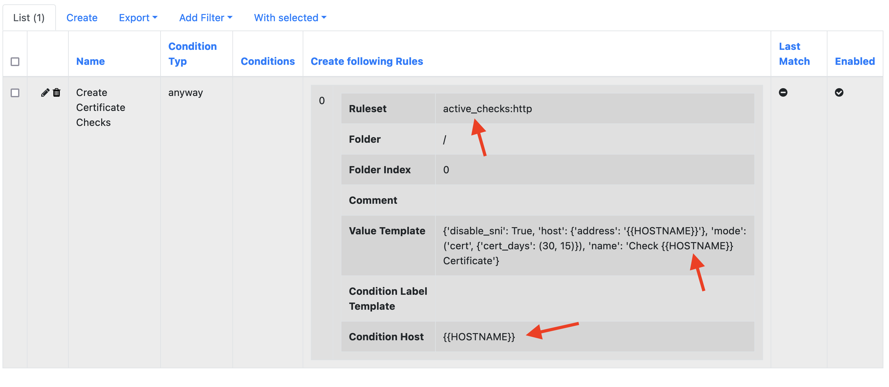
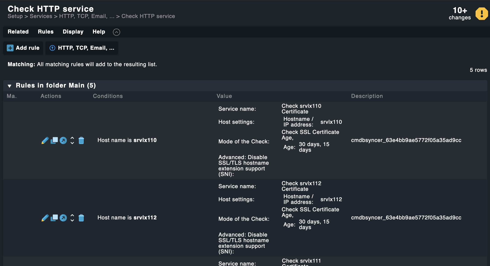

# Create Checkmk Rules Automatically

The Syncer can create any type of Checkmk setup rule automatically — including active checks, threshold rules, and more. Rules are created per host based on conditions and deleted again when the conditions no longer apply.

This guide shows the principle. For the full step-by-step workflow including how to find ruleset IDs and value formats, see [Manage Contact Groups](recipe_contact_groups.md).

## Workflow

1. Create one example rule in Checkmk of the type you want
2. Copy the ruleset name and API value (see [recipe_contact_groups.md](recipe_contact_groups.md))
3. Create a new Syncer rule in _Modules → Checkmk → Create Checkmk Setup Rules_
4. Set conditions for which hosts should get the rule
5. Paste the API value into the **Value Template** field
6. Replace host-specific parts with `{{HOSTNAME}}` or other attribute placeholders

## Value Template

The value template supports full Jinja. Any host attribute can be used as a placeholder. The **Condition Host** field also supports Jinja and comma-separated lists.

## Example: Active Certificate Check

This example creates an active certificate check for each host:

Result in Checkmk after export:

