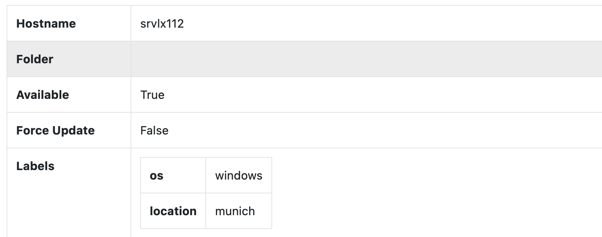
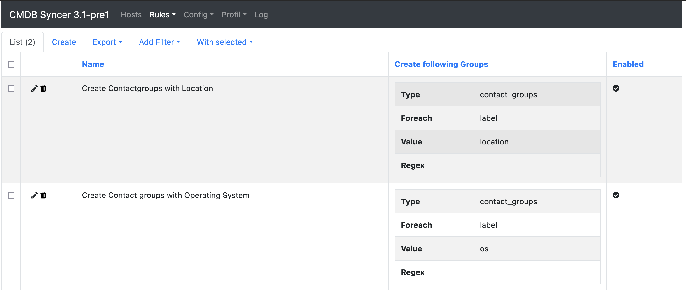
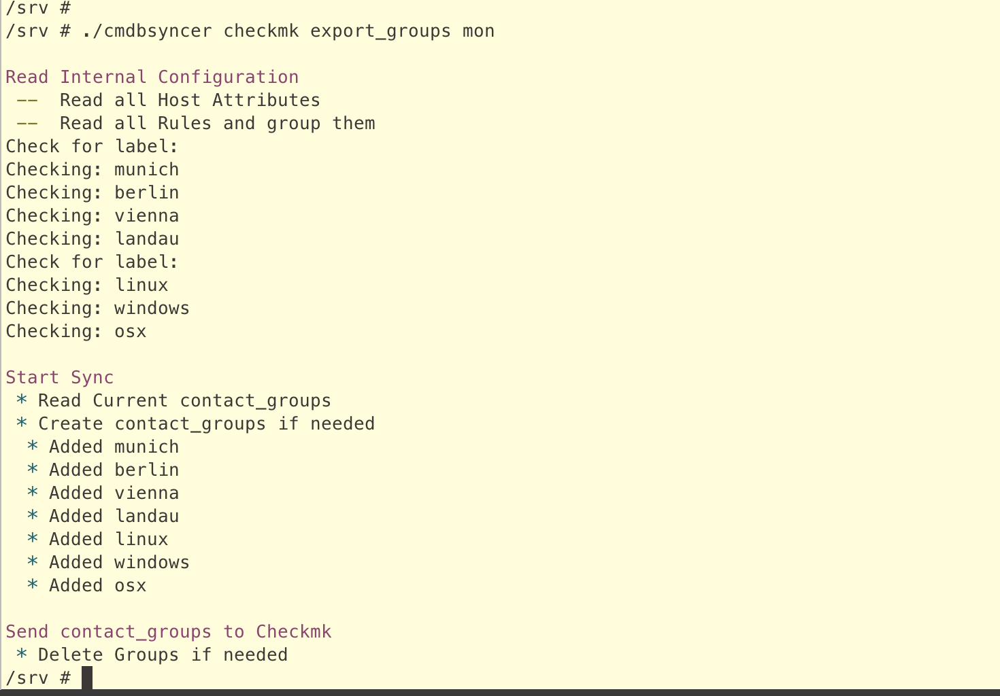
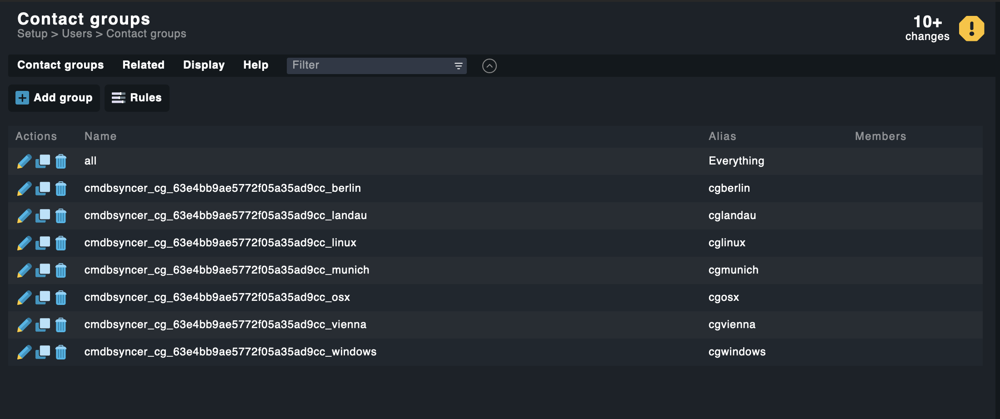
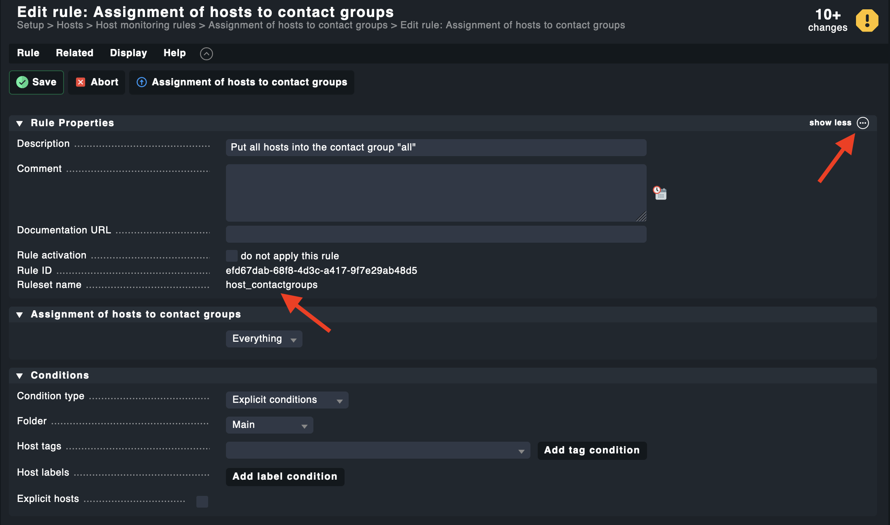
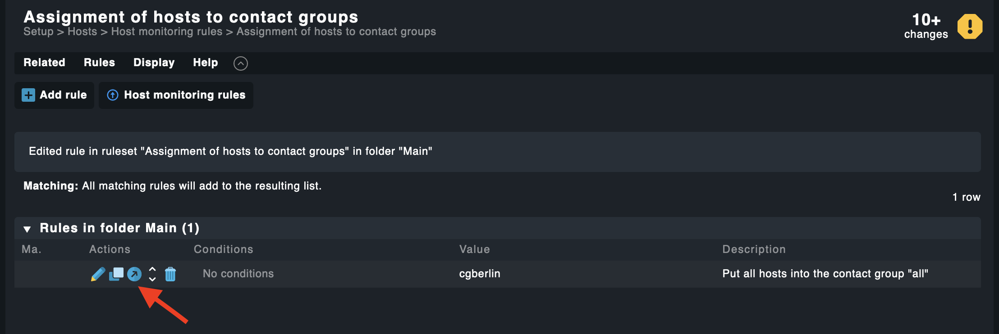
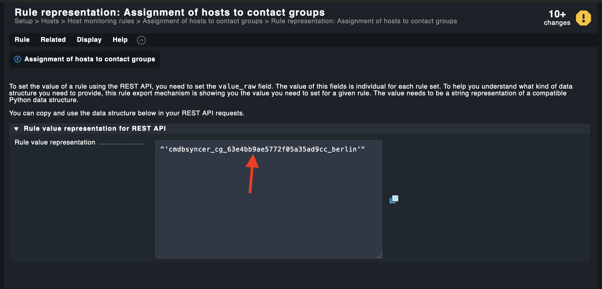
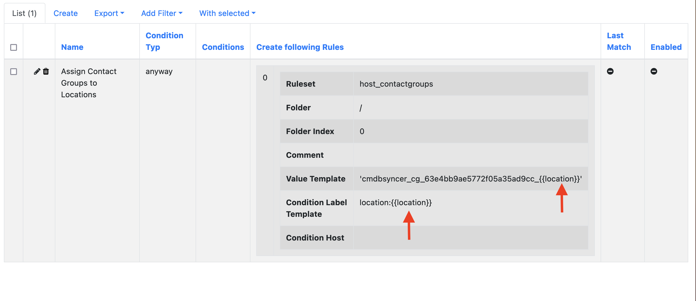
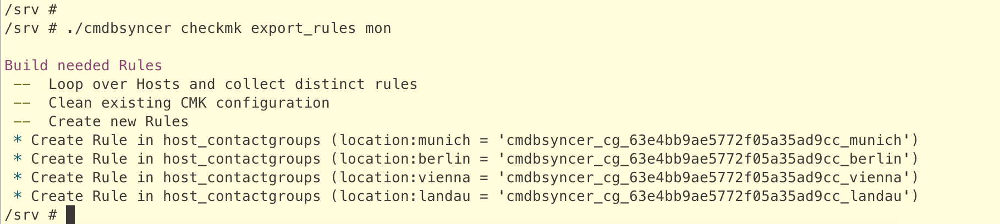
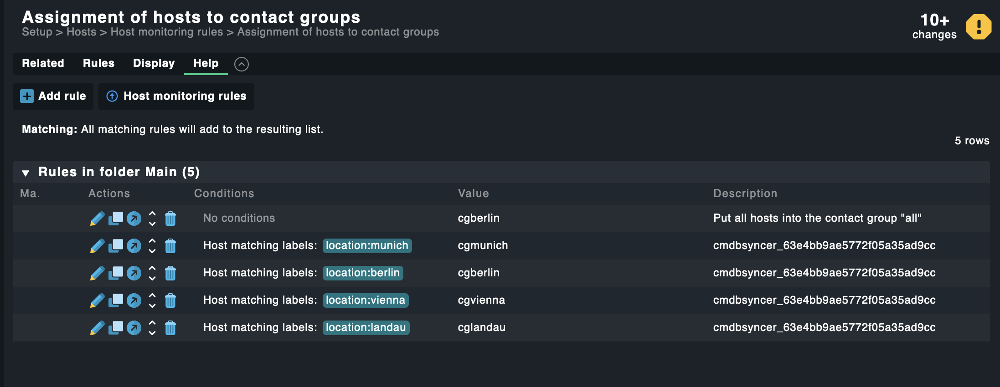

# Manage Contact Groups

This guide shows how to create Checkmk Contact Groups from host attributes and set up the corresponding assignment rules — all managed by the Syncer.

## Overview

Three things are needed:

1. Hosts with the attributes that should become group names
2. Group creation rules (see [Groups Management](groups_management.md))
3. Assignment rules (see [Manage Checkmk Setup Rules](rules_management.md))

## Step 1: The Attributes

Import the attributes you want to use as group names. In this example, the hosts have `os` and `location` attributes.

## Step 2: Create the Group Rule

Go to: _Modules → Checkmk → Manage Host-/Contact-/Service-Groups_

Create a rule for the `location` attribute:

- **Group Name:** Contact Groups
- **Foreach Type:** Foreach Attribute
- **Foreach:** `location`

Optionally, use Rewrite to control the group ID and title:

- **Rewrite:** `cg_{{name|lower}}`
- **Rewrite Title:** `{{name|capitalize}}`

After exporting, the groups appear in Checkmk:

!!! tip
    If your values follow a pattern like `contact_1`, `contact_2`, use `contact_*` as the Foreach value to match all values starting with that string.

## Step 3: Find the Ruleset Parameters

To create the assignment rule, you need the Checkmk ruleset ID and value format.

Navigate to the rule in Checkmk to find the ruleset name:

Then use the Checkmk API to get the value format. Open the API documentation and look up an existing rule of that type:

## Step 4: Create the Assignment Rule

Go to: _Modules → Checkmk → Create Checkmk Setup Rules_

Create a rule that assigns hosts to the contact group. Use `{{ location }}` to reference the host attribute as the condition label value:

Repeat for the `os` attribute.

## Step 5: Export and Verify

Run the export and check the result in Checkmk:

Activate the changes in Checkmk — done.
