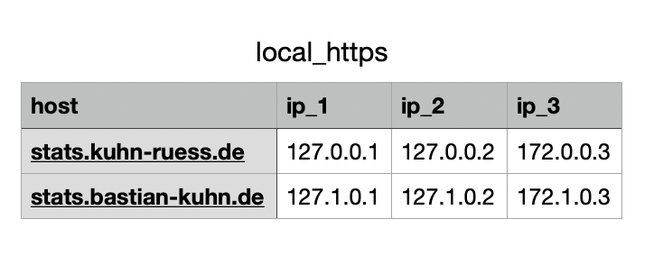
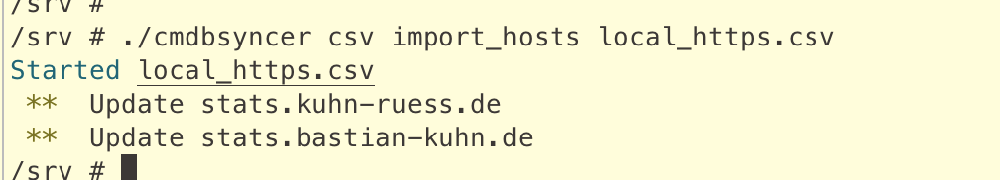
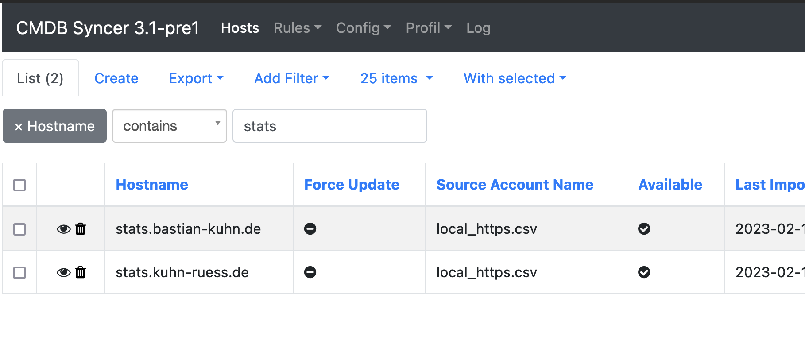
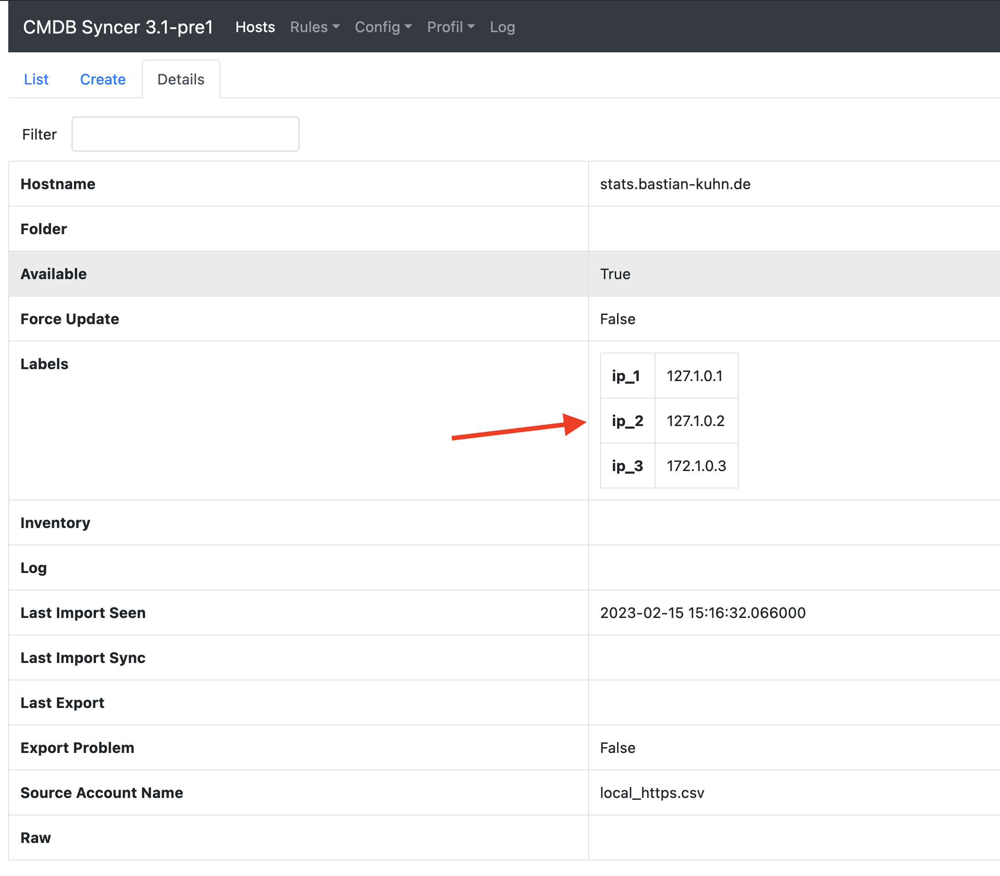
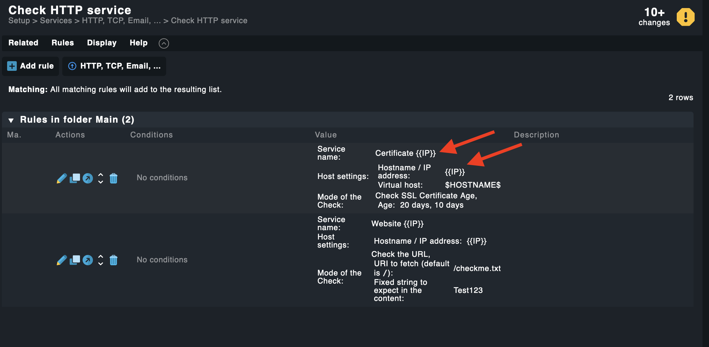
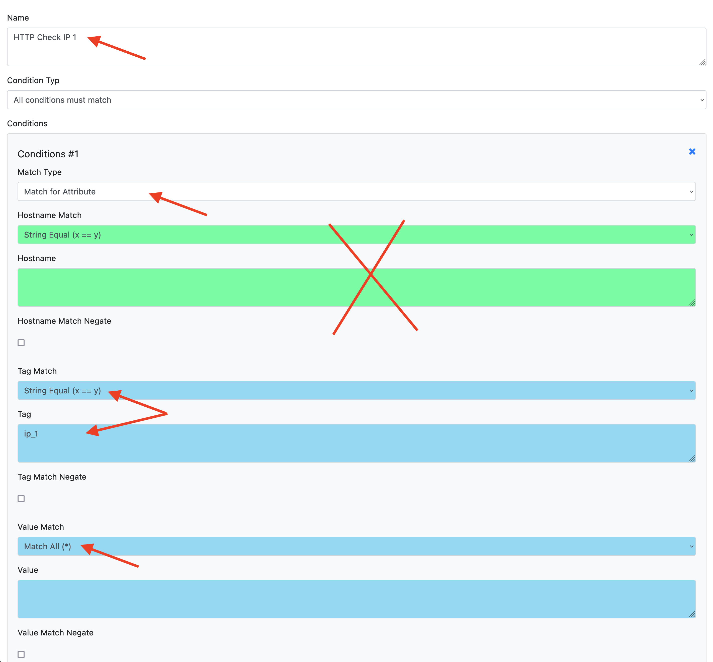
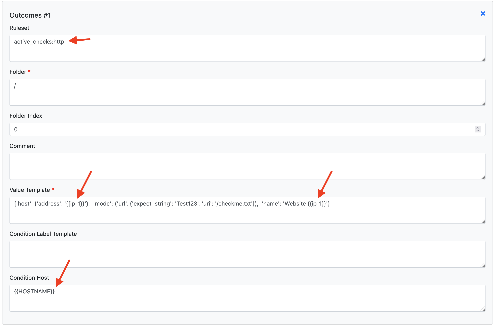
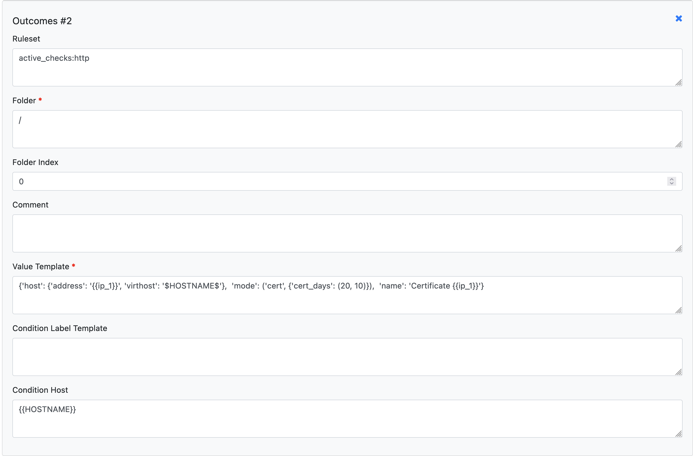
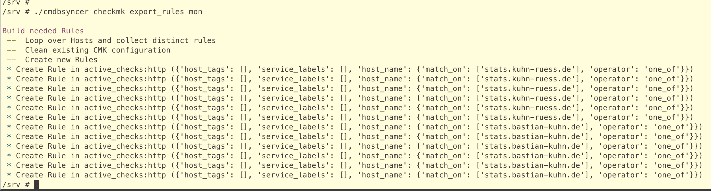
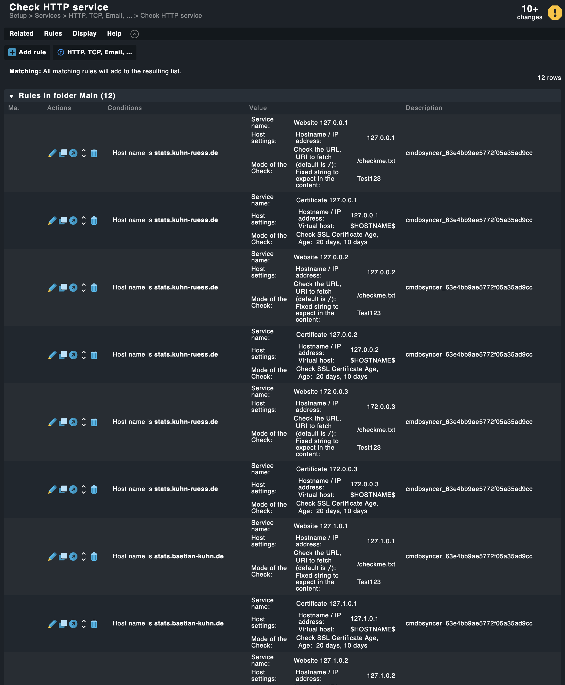

# Multiple HTTP Checks per Host

This example shows how to add multiple HTTP and certificate checks for hosts that have more than one IP address — one rule per IP column.

## What You Need

- A data source with multiple IP columns (CSV works well for this)
- One Syncer rule per IP address column
- Example rules in Checkmk to copy the API value from

## Step 1: The Data Source

Create a CSV with one column per IP address:

Import it as the main source:

The hosts appear in the Syncer with attributes `ip_1`, `ip_2`, `ip_3`:

## Step 2: Find the Rule Parameters

Create the two rule types you want (HTTP check and certificate check) in Checkmk, using `{{IP}}` as a placeholder wherever the IP address should appear. Then copy their API values as described in [Create Checkmk Rules Automatically](recipe_checkmk_rules.md).

## Step 3: Create the Syncer Rules

Go to: _Modules → Checkmk → Create Checkmk Setup Rules_

Create one rule per IP column. Each rule needs:

- **Condition:** The attribute (e.g. `ip_1`) must exist on the host. Set _Match Type_ to attribute, _Tag_ to `ip_1`, and use `Match All (*)` as the condition so any value matches.

    

- **Two outcomes:** One for the HTTP check, one for the certificate check. Replace `{{IP}}` with the actual attribute (`ip_1`).

    

    

Repeat for `ip_2` and `ip_3`. Enable each rule and save.

## Step 4: Sync

Delete the example rules you created in Checkmk. Then run the export:

No Checkmk activation is required between the rules export and the host export — you can activate all changes at the end.

## Result

After activation, Checkmk shows the HTTP and certificate checks for each IP:

