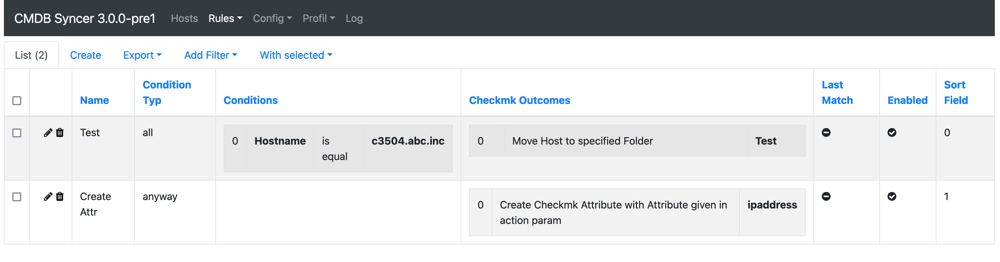
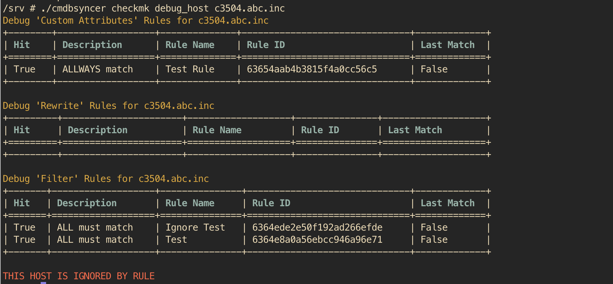

# Welcome to the CMDB Syncer

Rule Based and Modular System to syncronize Hosts into and between Checkmk, Netbox, I-Doit and all others Systems with Interfaces and APIs.
Main Goal is the complete Organization of the Hosts based on CMDB Systems and a full automation of Checkmk,

## Main Functions
* Web Interface with Login, 2FA and User management
* All configuration besides Installation in Web Interface
* Simple Plugin API to integrate own Data Sources
* Various Debug Options with the ./cmdbsyncer command
* Rules to control the Synchronization:
  * Based on Host Attributes
  * Attribute Rewrites
  * Filters fur Hosts and Attributes
  * Action Rules for Actions in Ansible, Checkmk, Netbox etc.
* Web Based management for Account Credentials.

## Modules and Functions

### Checkmk
* Mange full Host Lifecycle (creation, labels, folders, deletion, rules)
* Tested and performant with more than 140,000 Hosts
* Sync and Update all possible Host Attributes/ Tags/ Labels
* Full Support of API Bulk Operations
* Full management of Checkmk Folders
* Folder Pool Feature to split big amounts of Hosts automatically between folders (and therefore sites).
* Creation of Host-, Contact- and Service Groups
* Create Host Tags and Host Tag Groups
* Create BI Aggregations
* Integrated options to prevent to many Updates in Checkmk
* Full Multiprocessing support for Calculations
* Command to Active Configuration
* Command to Bake and Sign Agents
* Management of Checkmk (Fallback) users (Create/ Delete/ Reset Password/ Disable Login)
* Inventory for Host Attributes (need e.g. for Ansible, like on which site is server on)
* Inventory of Service Informations, Labels, Tags and HW/SW Inventory possible (can be used e.g. for I-Doit Sync)

### Ansible
* Rule Based Inventory Source
* All Functions for Checkmk Agent Management (Installation, TLS Registration, Bakery Registration)
	*  Linux and Windows
* All functions for Checkmk(OMD) Site Management (Update Sites, Create Sites etc.)
	* Automatic Download of Checkmk Versions if wanted.

### Netbox
* Rulebased Export and Import Devices and VMs to/from Netbox
* Automatic creation of Categories if wanted.

### I-DOIT
* Rulebased Export and Import Devices to/from I-Doit

### BMC Remedy
* Limited import from BMC Remedy

### Cisco DNA
* Import devices and their Interface Information

### CSV
* Manage Hosts based on CSV File (Import Source)
* Add Addional Informationen from CSV Files to your Hosts (eg. Overwrite IP Addresses)

## LDAP
 - Import Objects from LDAP Directories

## RestAPI
- Import of Custom Rest APIs

## JSON
- Import of Json File Structures

## Jira
- Import Objects

## MySQL
- Import and Inventorize Mysql Database Tables

## Mssql/ FreeDTS/ ODBC
- Import and Inventorize all kinds of ODBC based Database Connectsion
