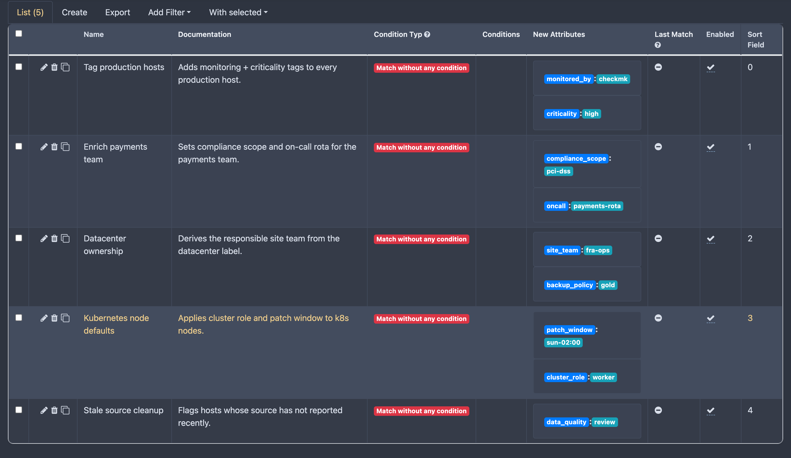

# CMDBsyncer

CMDBsyncer is a **rule-based, modular synchronization hub** for host and configuration data. It connects your source systems — CMDBs, asset management tools, APIs, CSV files — with your target systems like Checkmk, Netbox, or I-Doit, and keeps them in sync automatically.

Every connection to an external system is configured through an [Account](basics/accounts.md). Rules control what gets synchronized, how attributes are transformed, and which hosts are included.

---

## Key Features

- **Web Interface** with login, 2FA, and user management — all configuration after installation is done in the UI
- **Rule Engine** to control synchronization based on host attributes, with rewrite, filter, and condition support
- **Jinja support** throughout rules and configuration fields
- **Built-in CMDB mode** for managing objects, hosts, and templates directly in CMDBsyncer
- **Plugin API** to integrate custom data sources with minimal code
- **Cron management** to schedule sync jobs from the UI, including externally-triggered runs via per-group webhook tokens
- **Notifications** with email out of the box and rule-based routing — Slack, MS Teams and signed webhooks add on with the Enterprise license
- **REST API** for external automation
- **Ansible support** as a dynamic inventory source
- **Encryption** of stored credentials, with optional external secret stores (KeePass / Vault) under the Enterprise license
- **Debug tooling** via CLI and web-based debug views
- **Monitoring integration** via Checkmk Exchange check

---

## What's New in 4.0

Version 4.0 is a major release. Highlights — see the [changelog](https://github.com/Bastian-Kuhn/cmdbsyncer/blob/main/changelog/v4.0.md) for the full list:

### Community Edition

- **Admin UI refresh** across every page — consistent card layout for edit forms, sticky table headers, modernised login and start page, plugin-picker for new accounts
- **Notifications** — Settings → Notifications with Channels and Rules, email out of the box
- **Cron groups**: external webhook trigger with per-group token; resilient mode that continues remaining tasks on failure; auto-released locks; per-group "last successful run" tracking

### Enterprise (license-gated)

- **[Audit log](enterprise/audit_log.md)** — append-only compliance trail with field-level diffs, CSV/JSON export, optional [SIEM streaming](enterprise/audit_log.md#streaming-to-an-external-siem) (Splunk HEC, syslog, generic webhook)
- **[Native OIDC login](enterprise/oidc_login.md)** — Azure AD, Okta, Keycloak, Google Workspace, Auth0
- **[4-Eyes Approval Workflow](enterprise/approval_workflow.md)** — changes to critical resources queue up until a second admin approves
- **[Scheduled backups](enterprise/scheduled_backup.md)** — encrypted, rotated DB backups to any S3-compatible target or local path, each backup auto-manages its own protected cron group
- **[Prometheus metrics](enterprise/prometheus_metrics.md)** — `/metrics` endpoint with license info, per-cron-group state and host totals
- **[Signed webhook triggers](enterprise/webhook_signatures.md)** — HMAC-signed cron-trigger requests with replay window and per-group IP allowlists
- **[Notification routing](enterprise/notifications.md)** — Slack, MS Teams, signed webhooks; rules with templates, cooldowns and hourly caps
- **[Secrets manager](enterprise/secrets_manager.md)** — account passwords resolve from KeePass (more vault types planned), transparent to every plugin
- **[JSON log stream](enterprise/json_logging.md)** — Elastic Common Schema on stdout for Loki / Elastic / CloudWatch / Datadog / Splunk
- **License soft policy** — expired licenses keep every feature active and surface a banner instead of locking you out; an optional `max_hosts` cap warns over the limit but never disables anything

---

## Coming Soon

Two larger features are on dedicated branches and will land in a follow-up 4.x release:

### Ansible Workspace
A first-class workspace for running Ansible from CMDBsyncer:

- **Ansible Projects** — per-project rule sources, served as their own inventory provider
- **Run Playbook page** with a `--check --diff` preview button and a per-run inventory-provider picker
- **Fire Rule outcome** that triggers a playbook with the inventory of the matched hosts and is recorded as an audit event
- **Playbook catalog** via manifest with friendly names plus a `.local` override file
- **CLI under `cmdbsyncer ansible …`** with backward-compat shims for the old `-i ansible/inventory` invocations

### Notification Hub
A local "who do we alert and how" layer that is event-source agnostic, with Checkmk wired as the first caller:

- **Contacts**, **Contact Groups** (static + tag-dynamic + LDAP) and **Vacation** records
- **Shift calendars** synced from any iCal URL (Google, Outlook, CalDAV) — used as an on-call intersection filter
- **Dispatch rules** that match by source / event type / context regex and pick channels per recipient
- **REST endpoint** `POST /api/v1/notify/dispatch` and a sample Checkmk notification script
- **Channel reuse** — Slack, MS Teams, signed webhooks and email come from the Enterprise Notification Channels when licensed; falls back to a stdout log otherwise

---

## How it Works

CMDBsyncer imports hosts and attributes from one or more sources, processes them through the rules engine, and exports the result to the configured targets. Sources and targets can overlap — a system like Checkmk or Netbox can be both.

→ [How it Works](basics/how_it_works.md)

---

## Supported Integrations

### Full-Featured Modules

| Module | Import | Export | Notes |
| :----- | :----: | :----: | :---- |
| [Checkmk](checkmk/index.md) | ✓ | ✓ | Full host lifecycle, rules, tags, labels, groups, BI, DCD, agents, sites — tested with 140,000+ hosts |
| [Netbox](netbox/index.md) | ✓ | ✓ | Devices, VMs, interfaces, IPAM, contacts, sites |
| [I-Doit](i-doit/index.md) | ✓ | ✓ | Template-based device sync |
| [Ansible](ansible/index.md) | — | ✓ | Dynamic inventory source, Checkmk agent and site management |
| [CMDB Mode](cmdb/index.md) | ✓ | ✓ | Use CMDBsyncer itself as a lightweight CMDB |

### Import Sources

| Module | Description |
| :----- | :---------- |
| [REST API / JSON](rest_json/index.md) | Import from any REST API or JSON file structure |
| [CSV](csv/index.md) | Import hosts or enrich attributes from CSV files |
| [LDAP](ldap/index.md) | Import objects from LDAP directories |
| [JDisc](jdisc/index.md) | Import devices from JDisc Discovery |
| [Jira](jira/index.md) | Import objects from Jira (on-prem and cloud) |
| [Cisco DNA](ciscodna/index.md) | Import devices and interface information |
| BMC Remedy | Limited import from BMC Remedy |
| PRTG | Import objects from PRTG |
| VMware | Import and export attributes for VMware VMs |
| [MySQL](sql/index.md) | Import and inventorize MySQL database tables |
| [MSSQL / ODBC](sql/index.md) | Import from any ODBC-compatible database (FreeTDS, MSSQL, etc.) |

---

## Getting Started

1. Install CMDBsyncer: [Docker](installation/setup_docker.md) or [Apache/WSGI](installation/install_wsgi.md)
2. [Understand how it works](basics/how_it_works.md)
3. [Create your first Account](basics/accounts.md)
4. [Set up an Import](basics/import.md)
5. [Configure Rules](basics/conditions.md)
6. [Export to a target system](basics/export.md)
