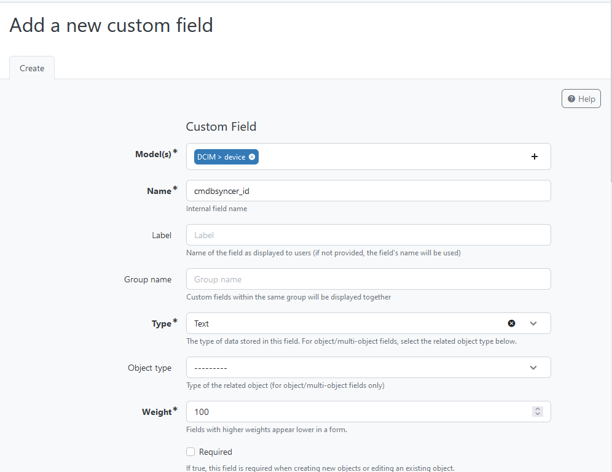
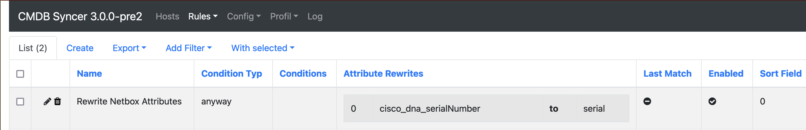
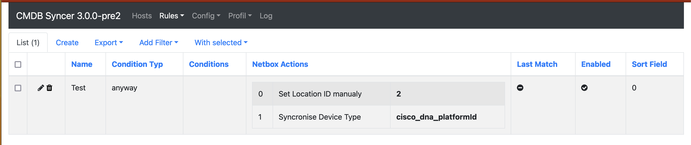

# DCIM Devices
If you want to sync your Hosts to Netbox, you find all information how to set this up here.
Your Hosts will be created as Devices. If you'd like to, you can also Synchronize Interfaces to Netbox.
As of now, the Source for Interface Data must be Cisco DNA, but this can and will change in the future for a more general support.

## Setup of Netbox
You need at Least an API Key, to Set up the Connection as Account in Syncer.
To create one, login to Netbox and switch to Admin → API Token.
This Token you have to set as Password for the Syncer Account you use with Netbox.

If the Netbox Installation is a new one, also make sure to set a Default Location (Site) which is required for every Device you create.

Also, you need to Set up a Reference Field for the Devices, that the Syncer can mark systems owned by him. This Field does not need to be Visible, and the Syncer uses it to store the Account ID in there. This way, the Syncer knows which Device was created by him. 

The final Step then is the configuration for the Attributes in Syncer; otherwise there will be an exception when you try to export your Hosts. 

To do so, switch to: Modules → Netbox → DCIM Device.

All about the Fields, follows below.

## Fields

There are two types of Fields in Netbox, one type, there you can directly store a string value in.
But the Other Type, is a Reference to other Objects.

### Required Fields
Without setting the Following Fields in Modules -> Netbox -> Netbox Fields, the Export always will fail.

| Fieldname | Description |
| ---- | ---- |
| `device type` | Can be Synced or Referenced by ID |
| `(device) role`  | Can be Synced or Referenced by ID |
| `site id` | ID need to by Set |
| `manufacturer` | This is a Sub Field for Device type, described below |

WARNING: Netbox did a Change in their API and changed a Field from device_role to just role.
Please note that you need to update your syncer if you run in a problem about missing device_role payload.

### Normal Text Field
Normal Netbox Text Fields can be synced with every attribute your Host in the Syncer has.
You just need to make sure to rewrite them to the Netbox Name. (See: [Rewrite Attributes](/basics/rewrite_attributes/)

Example:
In this Example a Attribute importet from Cisco DNA is converted to the field serial used in Netbox:

Here is a list of some more Netbox Fields you can use:

- serial
- comment
- primary_ip4
- primary_ip6
- face (rear/front)

### Fields which need Reference
The Following Fields need to set a Reference.
But don't worry, the syncer can create these References for you.
You can of course ignore fields as long there are not required by Netbox. 
You need either Sync them with attributes from Syncer, or you can Hard-code their Netbox IDs.

Here you have two examples. The Location ID in the example ist set to the Location with the ID 2 in Netbox. But the Device type automatically is synchronizeded with a Field imported from a Data source: 

Currently, the Syncer can automatically Sync the following Fields:

- Device Type
- Device Role
- Platform

### Special Cases
The Problem is, that some of the Reference Fields need even a Reverence by themselves.
These Fields need then to exist on your Host as Attribute
Here you find the Details to solve that

| Main Fields | Sub Field | Source in Syncer |
| ----- | ---- | ----- |
| Device Type | Manufacturer | Needs to be stored as Attribute named __manufacturer__ |

 

