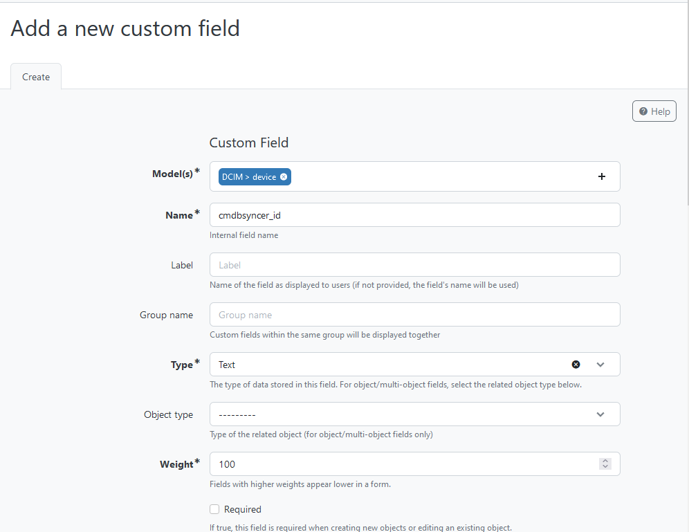

## Setup of Netbox
You need at Least an API Key, to Set up the Connection as Account in Syncer.
To create one, login to Netbox and switch to Admin → API Token.
This Token you have to set as Password for the Syncer Account you use with Netbox.

If the Netbox Installation is a new one, also make sure to set a Default Location (Site) which is required for every Device you create.

Also, you need to Set up a Reference Field for the Devices, that the Syncer can mark systems owned by him. This Field does not need to be Visible, and the Syncer uses it to store the Account ID in there. This way, the Syncer knows which Device was created by him. 

The final Step then is the configuration for the Attributes you want to sync; otherwise there will be an exception when you try to export your Hosts. 